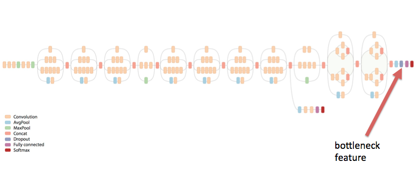

Tutorial - Transfer Learning
============================

.. code:: ipython2

    from defectlib import extract_bnfeatures_from_defect, train_svm_classifier, plot_tsne
    import numpy as np

    from defectlib import load_tensors
    from defectlib import load_tensors_all
    from defectlib import combine_shuffle_tensors, display_tensor, keras_transform, make_model, train_model
    from defectlib import Config, remove_sn, remain_sn
    from matplotlib import image
    from IPython.display import Image
    from tqdm import tqdm, trange
    import matplotlib.pyplot as plt
    import defectlib
    import cv2
    import os
    import numpy as np

    from bokeh.plotting import figure, output_notebook
    output_notebook()
    from bokeh.plotting import figure, show

    %matplotlib inline

.. parsed-literal::

    Using TensorFlow backend.

.. raw:: html

        

            
            Loading BokehJS ...
        

**pre-trained google Inception-v3 deep learning model**

Convolution Neural Network主要是兩個部分組成

1. 特徵萃取層 (Convolution layers, activation, max or average pooling)
2. 分類層 (fully connected layers)

Transfer Learning 的方法則是利用google inception
model訓練好的特徵萃取層來轉換原始圖片 (Inception-v3 model:
從2012年起利用ImageNet比賽的資料訓練進行訓練，1M照片/1000類別)

.. code:: ipython2

    from IPython.display import Image, display
    Image('images/07_inception_flowchart_bottleneck.png')

**Transfer Learning Flowchart**

我們將利用Inception V3 Model來轉換原始瑕疵圖片，轉換好的output是2048個維度的向量，又稱為embeddings．
這些轉換後的2048維度矩陣再利用SVM來建立分類模型．
我們也將利用t-sne來幫助我們了解轉換後的矩陣，其瑕疵圖片彼此間的差異．

.. code:: ipython2

    from IPython.display import Image, display
    Image('images/defect_inception_nn.png')

.. image:: images/transfer_process.png

.. code:: ipython2

    # transfer leraning
    from tensorflow.python.platform import gfile
    def create_graph(model_path):
        with gfile.FastGFile(model_path, 'rb') as f:
            graph_def = tf.GraphDef()
            # parse read file with parseFro
            graph_def.ParseFromString(f.read())
            # Load teh Inception-V3 file
            _ = tf.import_graph_def(graph_def, name='')

.. code:: ipython2

    def extract_bottleneck_features(list_images):
        '''extract buttleneck features from a list of images

        Notes:

        Args:
            list_images (list): a list of path_to_images

        Return:
            features (numpy array): an 2 dimensional numpy array,
                                    each row represents a transformed feature of an image

        '''
        # set up the expected transformed feature number
        nb_features = 2048

        # initial feature numpy array
        features = np.empty((len(list_images),nb_features))

        labels = []

        # specified the inception model
        create_graph('./inception_dec_2015/tensorflow_inception_graph.pb')

        with tf.Session() as sess:

            # Get a reference to the pool_3 layer
            next_to_last_tensor = sess.graph.get_tensor_by_name('pool_3:0')
            #return next_to_last_tensor
            for ind, image in enumerate(list_images):
                if (ind%100 == 0):
                    print('Processing %s...' % (image))
                if not gfile.Exists(image):
                    tf.logging.fatal('File does not exist %s', image)

                image_data = gfile.FastGFile(image, 'rb').read()
                print type(image_data)
                print image_data.shape
                predictions = sess.run(next_to_last_tensor,
                    {'DecodeJpeg/contents:0': image_data}
                )

                print predictions.shape

                features[ind,:] = np.squeeze(predictions)
                # labels.append(re.split('_\d+', image.split('/')[1])[0])
                # print labels

        return features

**利用google 訓練好的 inception model 將原始瑕疵影像轉換到2048維度
(embedding)**

.. code:: ipython2

    features, labels, sns, images = extract_bnfeatures_from_defect('./ben1214/CL0401/', comb=True)

.. parsed-literal::

    there are 26 images inside CL0401_2A_c0
    Processing ./ben1214/CL0401/2A/CL0401_2A_c0/CL0401_Recombination_0_2A_0.jpg...
    there are 60 images inside CL0401_2A_c1
    Processing ./ben1214/CL0401/2A/CL0401_2A_c1/CL0401_Recombination_F3Y64830U17GY4TA_2A_0.jpg...
    there are 207 images inside CL0401_2A_c4
    Processing ./ben1214/CL0401/2A/CL0401_2A_c4/CL0401_Recombination_F3Y6452037UGY4TA_2A_0.jpg...
    Processing ./ben1214/CL0401/2A/CL0401_2A_c4/CL0401_Recombination_F3Y65013JQKGY4TA_2A_5.jpg...
    Processing ./ben1214/CL0401/2A/CL0401_2A_c4/CL0401_Recombination_F3Y65050P7DGY4RB_2A_3.jpg...
    there are 29 images inside CL0401_6A_c0
    Processing ./ben1214/CL0401/6A/CL0401_6A_c0/CL0401_Recombination_0_6A_0.jpg...
    there are 36 images inside CL0401_6A_c4
    Processing ./ben1214/CL0401/6A/CL0401_6A_c4/CL0401_Recombination_F3Y6452037UGY4TA_6A_0.jpg...
    there are 39 images inside CL0401_6A_c7
    Processing ./ben1214/CL0401/6A/CL0401_6A_c7/CL0401_Recombination_F3Y649617UMH3RPA_6A_0.jpg...
    there are 19 images inside CL0401_8A_c1
    Processing ./ben1214/CL0401/8A/CL0401_8A_c1/CL0401_Recombination_F3Y64830U17GY4TA_8A_0.jpg...
    there are 17 images inside CL0401_8A_c4
    Processing ./ben1214/CL0401/8A/CL0401_8A_c4/CL0401_Recombination_F3Y6452037UGY4TA_8A_0.jpg...
    there are 15 images inside CL0401_8A_c7
    Processing ./ben1214/CL0401/8A/CL0401_8A_c7/CL0401_Recombination_F3Y649617UMH3RPA_8A_0.jpg...

.. code:: ipython2

    features.shape

.. parsed-literal::

    (448, 2048)

.. code:: ipython2

    labels.shape

.. parsed-literal::

    (448,)

.. code:: ipython2

    plot_tsne(features, labels, images, perplexity=20, interactive=False)

.. image:: images/tsne.png

.. code:: ipython2

    plot_tsne(features, labels, sns, perplexity=20, interactive=True, images=images)

.. raw:: html

        

            

        

    <script type="text/javascript">

      (function(global) {
        function now() {
          return new Date();
        }

        var force = "";

        if (typeof (window._bokeh_onload_callbacks) === "undefined" || force !== "") {
          window._bokeh_onload_callbacks = [];
          window._bokeh_is_loading = undefined;
        }

        if (typeof (window._bokeh_timeout) === "undefined" || force !== "") {
          window._bokeh_timeout = Date.now() + 0;
          window._bokeh_failed_load = false;
        }

        var NB_LOAD_WARNING = {'data': {'text/html':
           "
\n"+
           "
\n"+
           "BokehJS does not appear to have successfully loaded. If loading BokehJS from CDN, this \n"+
           "may be due to a slow or bad network connection. Possible fixes:\n"+
           "
\n"+
           "<ul>\n"+
           "<li>re-rerun `output_notebook()` to attempt to load from CDN again, or</li>\n"+
           "<li>use INLINE resources instead, as so:</li>\n"+
           "</ul>\n"+
           "<code>\n"+
           "from bokeh.resources import INLINE\n"+
           "output_notebook(resources=INLINE)\n"+
           "</code>\n"+
           "
"}};

        function display_loaded() {
          if (window.Bokeh !== undefined) {
            Bokeh.$("#2b94f6ac-e097-486b-b2a5-b143e80ee82a").text("BokehJS successfully loaded.");
          } else if (Date.now() < window._bokeh_timeout) {
            setTimeout(display_loaded, 100)
          }
        }

        function run_callbacks() {
          window._bokeh_onload_callbacks.forEach(function(callback) { callback() });
          delete window._bokeh_onload_callbacks
          console.info("Bokeh: all callbacks have finished");
        }

        function load_libs(js_urls, callback) {
          window._bokeh_onload_callbacks.push(callback);
          if (window._bokeh_is_loading > 0) {
            console.log("Bokeh: BokehJS is being loaded, scheduling callback at", now());
            return null;
          }
          if (js_urls == null || js_urls.length === 0) {
            run_callbacks();
            return null;
          }
          console.log("Bokeh: BokehJS not loaded, scheduling load and callback at", now());
          window._bokeh_is_loading = js_urls.length;
          for (var i = 0; i < js_urls.length; i++) {
            var url = js_urls[i];
            var s = document.createElement('script');
            s.src = url;
            s.async = false;
            s.onreadystatechange = s.onload = function() {
              window._bokeh_is_loading--;
              if (window._bokeh_is_loading === 0) {
                console.log("Bokeh: all BokehJS libraries loaded");
                run_callbacks()
              }
            };
            s.onerror = function() {
              console.warn("failed to load library " + url);
            };
            console.log("Bokeh: injecting script tag for BokehJS library: ", url);
            document.getElementsByTagName("head")[0].appendChild(s);
          }
        };var element = document.getElementById("2b94f6ac-e097-486b-b2a5-b143e80ee82a");
        if (element == null) {
          console.log("Bokeh: ERROR: autoload.js configured with elementid '2b94f6ac-e097-486b-b2a5-b143e80ee82a' but no matching script tag was found. ")
          return false;
        }

        var js_urls = [];

        var inline_js = [
          function(Bokeh) {
            Bokeh.$(function() {
                var docs_json = {"e4dd297a-c33c-4825-bed4-01a53718a772":{"roots":{"references":[{"attributes":{"callback":null,"column_names":["imgs","y","desc","x"],"data":{"desc":["F3Y6452037UGY4TA","F3Y6452037UGY4TA","F3Y6452037UGY4TA","F3Y6452037UGY4TA","F3Y6452037UGY4TA","F3Y6452037UGY4TA","F3Y6452037UGY4TA","F3Y6452037UGY4TA","F3Y6452037UGY4TA","F3Y6452037UGY4TA","F3Y6452037UGY4TA","F3Y647219XDH3RNA","F3Y647219XDH3RNA","F3Y647219XDH3RNA","F3Y647219XDH3RNA","F3Y647219XDH3RNA","F3Y647219XDH3RNA","F3Y647219XDH3RNA","F3Y647219XDH3RNA","F3Y647219XDH3RNA","F3Y647219XDH3RNA","F3Y647219XDH3RNA","F3Y64760V7WH3RNA","F3Y64760V7WH3RNA","F3Y64760V7WH3RNA","F3Y64760V7WH3RNA","F3Y64760V7WH3RNA","F3Y64760V7WH3RNA","F3Y64760V7WH3RNA","F3Y64760V7WH3RNA","F3Y64760V7WH3RNA","F3Y64760V7WH3RNA","F3Y6491000FGY4TA","F3Y6491000FGY4TA","F3Y6491000FGY4TA","F3Y6491000FGY4TA","F3Y6491000FGY4TA","F3Y6491000FGY4TA","F3Y6491000FGY4TA","F3Y6491000FGY4TA","F3Y6491000FGY4TA","F3Y64910ZSFGY4TA","F3Y64910ZSFGY4TA","F3Y64910ZSFGY4TA","F3Y64910ZSFGY4TA","F3Y64910ZSFGY4TA","F3Y64910ZSFGY4TA","F3Y64910ZSFGY4TA","F3Y64910ZSFGY4TA","F3Y64910ZSFGY4TA","F3Y64910ZSFGY4TA","F3Y64910ZSFGY4TA","F3Y64910ZSFGY4TA","F3Y64920UCWGY4TA","F3Y64920UCWGY4TA","F3Y64920UCWGY4TA","F3Y64920UCWGY4TA","F3Y64920UCWGY4TA","F3Y64920UCWGY4TA","F3Y64920UCWGY4TA","F3Y64920UCWGY4TA","F3Y64920UCWGY4TA","F3Y64920UCWGY4TA","F3Y64920UCWGY4TA","F3Y649504L0GY4TA","F3Y649504L0GY4TA","F3Y649504L0GY4TA","F3Y649504L0GY4TA","F3Y649504L0GY4TA","F3Y649504L0GY4TA","F3Y649504L0GY4TA","F3Y649504L0GY4TA","F3Y649504L0GY4TA","F3Y649504L0GY4TA","F3Y649504L0GY4TA","F3Y64950V9FH3RPA","F3Y64950V9FH3RPA","F3Y64950V9FH3RPA","F3Y64950V9FH3RPA","F3Y64950V9FH3RPA","F3Y64950V9FH3RPA","F3Y64950V9FH3RPA","F3Y64950V9FH3RPA","F3Y64950V9FH3RPA","F3Y64950V9FH3RPA","F3Y6501083MGY4TA","F3Y6501083MGY4TA","F3Y6501083MGY4TA","F3Y6501083MGY4TA","F3Y6501083MGY4TA","F3Y6501083MGY4TA","F3Y6501083MGY4TA","F3Y6501083MGY4TA","F3Y6501083MGY4TA","F3Y6501083MGY4TA","F3Y65013JQKGY4TA","F3Y65013JQKGY4TA","F3Y65013JQKGY4TA","F3Y65013JQKGY4TA","F3Y65013JQKGY4TA","F3Y65013JQKGY4TA","F3Y65013JQKGY4TA","F3Y65013JQKGY4TA","F3Y65013JQKGY4TA","F3Y65013JQKGY4TA","F3Y65020P8TGY4TA","F3Y65020P8TGY4TA","F3Y65020P8TGY4TA","F3Y65020P8TGY4TA","F3Y65020P8TGY4TA","F3Y65020P8TGY4TA","F3Y65020P8TGY4TA","F3Y65020P8TGY4TA","F3Y65020P8TGY4TA","F3Y65020P8TGY4TA","F3Y65030YU5GY4TA","F3Y65030YU5GY4TA","F3Y65030YU5GY4TA","F3Y65030YU5GY4TA","F3Y65030YU5GY4TA","F3Y65030YU5GY4TA","F3Y65030YU5GY4TA","F3Y65030YU5GY4TA","F3Y65030YU5GY4TA","F3Y65030YU5GY4TA","F3Y65030YU5GY4TA","F3Y650403D2H3RPA","F3Y650403D2H3RPA","F3Y650403D2H3RPA","F3Y650403D2H3RPA","F3Y650403D2H3RPA","F3Y650403D2H3RPA","F3Y650403D2H3RPA","F3Y650403D2H3RPA","F3Y650403D2H3RPA","F3Y650403D2H3RPA","F3Y650408E2GY4RA","F3Y650408E2GY4RA","F3Y650408E2GY4RA","F3Y650408E2GY4RA","F3Y650408E2GY4RA","F3Y650408E2GY4RA","F3Y650408E2GY4RA","F3Y650408E2GY4RA","F3Y650408E2GY4RA","F3Y650408E2GY4RA","F3Y65040ST2GY4RA","F3Y65040ST2GY4RA","F3Y65040ST2GY4RA","F3Y65040ST2GY4RA","F3Y65040ST2GY4RA","F3Y65040ST2GY4RA","F3Y65040ST2GY4RA","F3Y65040ST2GY4RA","F3Y65040ST2GY4RA","F3Y65040ST2GY4RA","F3Y65040ST2GY4RA","F3Y65050B9NH3RQC","F3Y65050B9NH3RQC","F3Y65050B9NH3RQC","F3Y65050B9NH3RQC","F3Y65050B9NH3RQC","F3Y65050B9NH3RQC","F3Y65050B9NH3RQC","F3Y65050B9NH3RQC","F3Y65050B9NH3RQC","F3Y65050B9NH3RQC","F3Y65050EF8GY4TB","F3Y65050EF8GY4TB","F3Y65050EF8GY4TB","F3Y65050EF8GY4TB","F3Y65050EF8GY4TB","F3Y65050EF8GY4TB","F3Y65050EF8GY4TB","F3Y65050EF8GY4TB","F3Y65050EF8GY4TB","F3Y65050EF8GY4TB","F3Y65050FNZGY4TB","F3Y65050FNZGY4TB","F3Y65050FNZGY4TB","F3Y65050FNZGY4TB","F3Y65050FNZGY4TB","F3Y65050FNZGY4TB","F3Y65050FNZGY4TB","F3Y65050FNZGY4TB","F3Y65050FNZGY4TB","F3Y65050FNZGY4TB","F3Y65050FX3GY4RB","F3Y65050FX3GY4RB","F3Y65050FX3GY4RB","F3Y65050FX3GY4RB","F3Y65050FX3GY4RB","F3Y65050FX3GY4RB","F3Y65050FX3GY4RB","F3Y65050FX3GY4RB","F3Y65050FX3GY4RB","F3Y65050FX3GY4RB","F3Y65050P7DGY4RB","F3Y65050P7DGY4RB","F3Y65050P7DGY4RB","F3Y65050P7DGY4RB","F3Y65050P7DGY4RB","F3Y65050P7DGY4RB","F3Y65050P7DGY4RB","F3Y65050P7DGY4RB","F3Y65050P7DGY4RB","F3Y65050P7DGY4RB","F3Y6452037UGY4TA","F3Y647219XDH3RNA","F3Y64760V7WH3RNA","F3Y64760V7WH3RNA","F3Y64760V7WH3RNA","F3Y6491000FGY4TA","F3Y6491000FGY4TA","F3Y64910ZSFGY4TA","F3Y64910ZSFGY4TA","F3Y64910ZSFGY4TA","F3Y64910ZSFGY4TA","F3Y64920UCWGY4TA","F3Y64920UCWGY4TA","F3Y64920UCWGY4TA","F3Y649504L0GY4TA","F3Y649504L0GY4TA","F3Y64950V9FH3RPA","F3Y64950V9FH3RPA","F3Y64950V9FH3RPA","F3Y6501083MGY4TA","F3Y65013JQKGY4TA","F3Y65020P8TGY4TA","F3Y65030YU5GY4TA","F3Y65030YU5GY4TA","F3Y650403D2H3RPA","F3Y650403D2H3RPA","F3Y650408E2GY4RA","F3Y650408E2GY4RA","F3Y65040ST2GY4RA","F3Y65050B9NH3RQC","F3Y65050B9NH3RQC","F3Y65050EF8GY4TB","F3Y65050FNZGY4TB","F3Y65050FX3GY4RB","F3Y65050P7DGY4RB","F3Y65050P7DGY4RB","F3Y6452037UGY4TA","F3Y647219XDH3RNA","F3Y64760V7WH3RNA","F3Y6491000FGY4TA","F3Y64910ZSFGY4TA","F3Y64920UCWGY4TA","F3Y649504L0GY4TA","F3Y64950V9FH3RPA","F3Y6501083MGY4TA","F3Y65013JQKGY4TA","F3Y65020P8TGY4TA","F3Y65030YU5GY4TA","F3Y65040ST2GY4RA","F3Y65050B9NH3RQC","F3Y65050EF8GY4TB","F3Y65050FNZGY4TB","F3Y65050P7DGY4RB"],"imgs":["./ben1214/CL0401/2A/CL0401_2A_c4/CL0401_Recombination_F3Y6452037UGY4TA_2A_0.jpg","./ben1214/CL0401/2A/CL0401_2A_c4/CL0401_Recombination_F3Y6452037UGY4TA_2A_1.jpg","./ben1214/CL0401/2A/CL0401_2A_c4/CL0401_Recombination_F3Y6452037UGY4TA_2A_10.jpg","./ben1214/CL0401/2A/CL0401_2A_c4/CL0401_Recombination_F3Y6452037UGY4TA_2A_2.jpg","./ben1214/CL0401/2A/CL0401_2A_c4/CL0401_Recombination_F3Y6452037UGY4TA_2A_3.jpg","./ben1214/CL0401/2A/CL0401_2A_c4/CL0401_Recombination_F3Y6452037UGY4TA_2A_4.jpg","./ben1214/CL0401/2A/CL0401_2A_c4/CL0401_Recombination_F3Y6452037UGY4TA_2A_5.jpg","./ben1214/CL0401/2A/CL0401_2A_c4/CL0401_Recombination_F3Y6452037UGY4TA_2A_6.jpg","./ben1214/CL0401/2A/CL0401_2A_c4/CL0401_Recombination_F3Y6452037UGY4TA_2A_7.jpg","./ben1214/CL0401/2A/CL0401_2A_c4/CL0401_Recombination_F3Y6452037UGY4TA_2A_8.jpg","./ben1214/CL0401/2A/CL0401_2A_c4/CL0401_Recombination_F3Y6452037UGY4TA_2A_9.jpg","./ben1214/CL0401/2A/CL0401_2A_c4/CL0401_Recombination_F3Y647219XDH3RNA_2A_0.jpg","./ben1214/CL0401/2A/CL0401_2A_c4/CL0401_Recombination_F3Y647219XDH3RNA_2A_1.jpg","./ben1214/CL0401/2A/CL0401_2A_c4/CL0401_Recombination_F3Y647219XDH3RNA_2A_10.jpg","./ben1214/CL0401/2A/CL0401_2A_c4/CL0401_Recombination_F3Y647219XDH3RNA_2A_2.jpg","./ben1214/CL0401/2A/CL0401_2A_c4/CL0401_Recombination_F3Y647219XDH3RNA_2A_3.jpg","./ben1214/CL0401/2A/CL0401_2A_c4/CL0401_Recombination_F3Y647219XDH3RNA_2A_4.jpg","./ben1214/CL0401/2A/CL0401_2A_c4/CL0401_Recombination_F3Y647219XDH3RNA_2A_5.jpg","./ben1214/CL0401/2A/CL0401_2A_c4/CL0401_Recombination_F3Y647219XDH3RNA_2A_6.jpg","./ben1214/CL0401/2A/CL0401_2A_c4/CL0401_Recombination_F3Y647219XDH3RNA_2A_7.jpg","./ben1214/CL0401/2A/CL0401_2A_c4/CL0401_Recombination_F3Y647219XDH3RNA_2A_8.jpg","./ben1214/CL0401/2A/CL0401_2A_c4/CL0401_Recombination_F3Y647219XDH3RNA_2A_9.jpg","./ben1214/CL0401/2A/CL0401_2A_c4/CL0401_Recombination_F3Y64760V7WH3RNA_2A_0.jpg","./ben1214/CL0401/2A/CL0401_2A_c4/CL0401_Recombination_F3Y64760V7WH3RNA_2A_1.jpg","./ben1214/CL0401/2A/CL0401_2A_c4/CL0401_Recombination_F3Y64760V7WH3RNA_2A_2.jpg","./ben1214/CL0401/2A/CL0401_2A_c4/CL0401_Recombination_F3Y64760V7WH3RNA_2A_3.jpg","./ben1214/CL0401/2A/CL0401_2A_c4/CL0401_Recombination_F3Y64760V7WH3RNA_2A_4.jpg","./ben1214/CL0401/2A/CL0401_2A_c4/CL0401_Recombination_F3Y64760V7WH3RNA_2A_5.jpg","./ben1214/CL0401/2A/CL0401_2A_c4/CL0401_Recombination_F3Y64760V7WH3RNA_2A_6.jpg","./ben1214/CL0401/2A/CL0401_2A_c4/CL0401_Recombination_F3Y64760V7WH3RNA_2A_7.jpg","./ben1214/CL0401/2A/CL0401_2A_c4/CL0401_Recombination_F3Y64760V7WH3RNA_2A_8.jpg","./ben1214/CL0401/2A/CL0401_2A_c4/CL0401_Recombination_F3Y64760V7WH3RNA_2A_9.jpg","./ben1214/CL0401/2A/CL0401_2A_c4/CL0401_Recombination_F3Y6491000FGY4TA_2A_0.jpg","./ben1214/CL0401/2A/CL0401_2A_c4/CL0401_Recombination_F3Y6491000FGY4TA_2A_1.jpg","./ben1214/CL0401/2A/CL0401_2A_c4/CL0401_Recombination_F3Y6491000FGY4TA_2A_2.jpg","./ben1214/CL0401/2A/CL0401_2A_c4/CL0401_Recombination_F3Y6491000FGY4TA_2A_3.jpg","./ben1214/CL0401/2A/CL0401_2A_c4/CL0401_Recombination_F3Y6491000FGY4TA_2A_4.jpg","./ben1214/CL0401/2A/CL0401_2A_c4/CL0401_Recombination_F3Y6491000FGY4TA_2A_5.jpg","./ben1214/CL0401/2A/CL0401_2A_c4/CL0401_Recombination_F3Y6491000FGY4TA_2A_6.jpg","./ben1214/CL0401/2A/CL0401_2A_c4/CL0401_Recombination_F3Y6491000FGY4TA_2A_7.jpg","./ben1214/CL0401/2A/CL0401_2A_c4/CL0401_Recombination_F3Y6491000FGY4TA_2A_8.jpg","./ben1214/CL0401/2A/CL0401_2A_c4/CL0401_Recombination_F3Y64910ZSFGY4TA_2A_0.jpg","./ben1214/CL0401/2A/CL0401_2A_c4/CL0401_Recombination_F3Y64910ZSFGY4TA_2A_1.jpg","./ben1214/CL0401/2A/CL0401_2A_c4/CL0401_Recombination_F3Y64910ZSFGY4TA_2A_10.jpg","./ben1214/CL0401/2A/CL0401_2A_c4/CL0401_Recombination_F3Y64910ZSFGY4TA_2A_11.jpg","./ben1214/CL0401/2A/CL0401_2A_c4/CL0401_Recombination_F3Y64910ZSFGY4TA_2A_2.jpg","./ben1214/CL0401/2A/CL0401_2A_c4/CL0401_Recombination_F3Y64910ZSFGY4TA_2A_3.jpg","./ben1214/CL0401/2A/CL0401_2A_c4/CL0401_Recombination_F3Y64910ZSFGY4TA_2A_4.jpg","./ben1214/CL0401/2A/CL0401_2A_c4/CL0401_Recombination_F3Y64910ZSFGY4TA_2A_5.jpg","./ben1214/CL0401/2A/CL0401_2A_c4/CL0401_Recombination_F3Y64910ZSFGY4TA_2A_6.jpg","./ben1214/CL0401/2A/CL0401_2A_c4/CL0401_Recombination_F3Y64910ZSFGY4TA_2A_7.jpg","./ben1214/CL0401/2A/CL0401_2A_c4/CL0401_Recombination_F3Y64910ZSFGY4TA_2A_8.jpg","./ben1214/CL0401/2A/CL0401_2A_c4/CL0401_Recombination_F3Y64910ZSFGY4TA_2A_9.jpg","./ben1214/CL0401/2A/CL0401_2A_c4/CL0401_Recombination_F3Y64920UCWGY4TA_2A_0.jpg","./ben1214/CL0401/2A/CL0401_2A_c4/CL0401_Recombination_F3Y64920UCWGY4TA_2A_1.jpg","./ben1214/CL0401/2A/CL0401_2A_c4/CL0401_Recombination_F3Y64920UCWGY4TA_2A_10.jpg","./ben1214/CL0401/2A/CL0401_2A_c4/CL0401_Recombination_F3Y64920UCWGY4TA_2A_2.jpg","./ben1214/CL0401/2A/CL0401_2A_c4/CL0401_Recombination_F3Y64920UCWGY4TA_2A_3.jpg","./ben1214/CL0401/2A/CL0401_2A_c4/CL0401_Recombination_F3Y64920UCWGY4TA_2A_4.jpg","./ben1214/CL0401/2A/CL0401_2A_c4/CL0401_Recombination_F3Y64920UCWGY4TA_2A_5.jpg","./ben1214/CL0401/2A/CL0401_2A_c4/CL0401_Recombination_F3Y64920UCWGY4TA_2A_6.jpg","./ben1214/CL0401/2A/CL0401_2A_c4/CL0401_Recombination_F3Y64920UCWGY4TA_2A_7.jpg","./ben1214/CL0401/2A/CL0401_2A_c4/CL0401_Recombination_F3Y64920UCWGY4TA_2A_8.jpg","./ben1214/CL0401/2A/CL0401_2A_c4/CL0401_Recombination_F3Y64920UCWGY4TA_2A_9.jpg","./ben1214/CL0401/2A/CL0401_2A_c4/CL0401_Recombination_F3Y649504L0GY4TA_2A_0.jpg","./ben1214/CL0401/2A/CL0401_2A_c4/CL0401_Recombination_F3Y649504L0GY4TA_2A_1.jpg","./ben1214/CL0401/2A/CL0401_2A_c4/CL0401_Recombination_F3Y649504L0GY4TA_2A_10.jpg","./ben1214/CL0401/2A/CL0401_2A_c4/CL0401_Recombination_F3Y649504L0GY4TA_2A_2.jpg","./ben1214/CL0401/2A/CL0401_2A_c4/CL0401_Recombination_F3Y649504L0GY4TA_2A_3.jpg","./ben1214/CL0401/2A/CL0401_2A_c4/CL0401_Recombination_F3Y649504L0GY4TA_2A_4.jpg","./ben1214/CL0401/2A/CL0401_2A_c4/CL0401_Recombination_F3Y649504L0GY4TA_2A_5.jpg","./ben1214/CL0401/2A/CL0401_2A_c4/CL0401_Recombination_F3Y649504L0GY4TA_2A_6.jpg","./ben1214/CL0401/2A/CL0401_2A_c4/CL0401_Recombination_F3Y649504L0GY4TA_2A_7.jpg","./ben1214/CL0401/2A/CL0401_2A_c4/CL0401_Recombination_F3Y649504L0GY4TA_2A_8.jpg","./ben1214/CL0401/2A/CL0401_2A_c4/CL0401_Recombination_F3Y649504L0GY4TA_2A_9.jpg","./ben1214/CL0401/2A/CL0401_2A_c4/CL0401_Recombination_F3Y64950V9FH3RPA_2A_0.jpg","./ben1214/CL0401/2A/CL0401_2A_c4/CL0401_Recombination_F3Y64950V9FH3RPA_2A_1.jpg","./ben1214/CL0401/2A/CL0401_2A_c4/CL0401_Recombination_F3Y64950V9FH3RPA_2A_2.jpg","./ben1214/CL0401/2A/CL0401_2A_c4/CL0401_Recombination_F3Y64950V9FH3RPA_2A_3.jpg","./ben1214/CL0401/2A/CL0401_2A_c4/CL0401_Recombination_F3Y64950V9FH3RPA_2A_4.jpg","./ben1214/CL0401/2A/CL0401_2A_c4/CL0401_Recombination_F3Y64950V9FH3RPA_2A_5.jpg","./ben1214/CL0401/2A/CL0401_2A_c4/CL0401_Recombination_F3Y64950V9FH3RPA_2A_6.jpg","./ben1214/CL0401/2A/CL0401_2A_c4/CL0401_Recombination_F3Y64950V9FH3RPA_2A_7.jpg","./ben1214/CL0401/2A/CL0401_2A_c4/CL0401_Recombination_F3Y64950V9FH3RPA_2A_8.jpg","./ben1214/CL0401/2A/CL0401_2A_c4/CL0401_Recombination_F3Y64950V9FH3RPA_2A_9.jpg","./ben1214/CL0401/2A/CL0401_2A_c4/CL0401_Recombination_F3Y6501083MGY4TA_2A_0.jpg","./ben1214/CL0401/2A/CL0401_2A_c4/CL0401_Recombination_F3Y6501083MGY4TA_2A_1.jpg","./ben1214/CL0401/2A/CL0401_2A_c4/CL0401_Recombination_F3Y6501083MGY4TA_2A_2.jpg","./ben1214/CL0401/2A/CL0401_2A_c4/CL0401_Recombination_F3Y6501083MGY4TA_2A_3.jpg","./ben1214/CL0401/2A/CL0401_2A_c4/CL0401_Recombination_F3Y6501083MGY4TA_2A_4.jpg","./ben1214/CL0401/2A/CL0401_2A_c4/CL0401_Recombination_F3Y6501083MGY4TA_2A_5.jpg","./ben1214/CL0401/2A/CL0401_2A_c4/CL0401_Recombination_F3Y6501083MGY4TA_2A_6.jpg","./ben1214/CL0401/2A/CL0401_2A_c4/CL0401_Recombination_F3Y6501083MGY4TA_2A_7.jpg","./ben1214/CL0401/2A/CL0401_2A_c4/CL0401_Recombination_F3Y6501083MGY4TA_2A_8.jpg","./ben1214/CL0401/2A/CL0401_2A_c4/CL0401_Recombination_F3Y6501083MGY4TA_2A_9.jpg","./ben1214/CL0401/2A/CL0401_2A_c4/CL0401_Recombination_F3Y65013JQKGY4TA_2A_0.jpg","./ben1214/CL0401/2A/CL0401_2A_c4/CL0401_Recombination_F3Y65013JQKGY4TA_2A_1.jpg","./ben1214/CL0401/2A/CL0401_2A_c4/CL0401_Recombination_F3Y65013JQKGY4TA_2A_2.jpg","./ben1214/CL0401/2A/CL0401_2A_c4/CL0401_Recombination_F3Y65013JQKGY4TA_2A_3.jpg","./ben1214/CL0401/2A/CL0401_2A_c4/CL0401_Recombination_F3Y65013JQKGY4TA_2A_4.jpg","./ben1214/CL0401/2A/CL0401_2A_c4/CL0401_Recombination_F3Y65013JQKGY4TA_2A_5.jpg","./ben1214/CL0401/2A/CL0401_2A_c4/CL0401_Recombination_F3Y65013JQKGY4TA_2A_6.jpg","./ben1214/CL0401/2A/CL0401_2A_c4/CL0401_Recombination_F3Y65013JQKGY4TA_2A_7.jpg","./ben1214/CL0401/2A/CL0401_2A_c4/CL0401_Recombination_F3Y65013JQKGY4TA_2A_8.jpg","./ben1214/CL0401/2A/CL0401_2A_c4/CL0401_Recombination_F3Y65013JQKGY4TA_2A_9.jpg","./ben1214/CL0401/2A/CL0401_2A_c4/CL0401_Recombination_F3Y65020P8TGY4TA_2A_0.jpg","./ben1214/CL0401/2A/CL0401_2A_c4/CL0401_Recombination_F3Y65020P8TGY4TA_2A_1.jpg","./ben1214/CL0401/2A/CL0401_2A_c4/CL0401_Recombination_F3Y65020P8TGY4TA_2A_2.jpg","./ben1214/CL0401/2A/CL0401_2A_c4/CL0401_Recombination_F3Y65020P8TGY4TA_2A_3.jpg","./ben1214/CL0401/2A/CL0401_2A_c4/CL0401_Recombination_F3Y65020P8TGY4TA_2A_4.jpg","./ben1214/CL0401/2A/CL0401_2A_c4/CL0401_Recombination_F3Y65020P8TGY4TA_2A_5.jpg","./ben1214/CL0401/2A/CL0401_2A_c4/CL0401_Recombination_F3Y65020P8TGY4TA_2A_6.jpg","./ben1214/CL0401/2A/CL0401_2A_c4/CL0401_Recombination_F3Y65020P8TGY4TA_2A_7.jpg","./ben1214/CL0401/2A/CL0401_2A_c4/CL0401_Recombination_F3Y65020P8TGY4TA_2A_8.jpg","./ben1214/CL0401/2A/CL0401_2A_c4/CL0401_Recombination_F3Y65020P8TGY4TA_2A_9.jpg","./ben1214/CL0401/2A/CL0401_2A_c4/CL0401_Recombination_F3Y65030YU5GY4TA_2A_0.jpg","./ben1214/CL0401/2A/CL0401_2A_c4/CL0401_Recombination_F3Y65030YU5GY4TA_2A_1.jpg","./ben1214/CL0401/2A/CL0401_2A_c4/CL0401_Recombination_F3Y65030YU5GY4TA_2A_10.jpg","./ben1214/CL0401/2A/CL0401_2A_c4/CL0401_Recombination_F3Y65030YU5GY4TA_2A_2.jpg","./ben1214/CL0401/2A/CL0401_2A_c4/CL0401_Recombination_F3Y65030YU5GY4TA_2A_3.jpg","./ben1214/CL0401/2A/CL0401_2A_c4/CL0401_Recombination_F3Y65030YU5GY4TA_2A_4.jpg","./ben1214/CL0401/2A/CL0401_2A_c4/CL0401_Recombination_F3Y65030YU5GY4TA_2A_5.jpg","./ben1214/CL0401/2A/CL0401_2A_c4/CL0401_Recombination_F3Y65030YU5GY4TA_2A_6.jpg","./ben1214/CL0401/2A/CL0401_2A_c4/CL0401_Recombination_F3Y65030YU5GY4TA_2A_7.jpg","./ben1214/CL0401/2A/CL0401_2A_c4/CL0401_Recombination_F3Y65030YU5GY4TA_2A_8.jpg","./ben1214/CL0401/2A/CL0401_2A_c4/CL0401_Recombination_F3Y65030YU5GY4TA_2A_9.jpg","./ben1214/CL0401/2A/CL0401_2A_c4/CL0401_Recombination_F3Y650403D2H3RPA_2A_0.jpg","./ben1214/CL0401/2A/CL0401_2A_c4/CL0401_Recombination_F3Y650403D2H3RPA_2A_1.jpg","./ben1214/CL0401/2A/CL0401_2A_c4/CL0401_Recombination_F3Y650403D2H3RPA_2A_2.jpg","./ben1214/CL0401/2A/CL0401_2A_c4/CL0401_Recombination_F3Y650403D2H3RPA_2A_3.jpg","./ben1214/CL0401/2A/CL0401_2A_c4/CL0401_Recombination_F3Y650403D2H3RPA_2A_4.jpg","./ben1214/CL0401/2A/CL0401_2A_c4/CL0401_Recombination_F3Y650403D2H3RPA_2A_5.jpg","./ben1214/CL0401/2A/CL0401_2A_c4/CL0401_Recombination_F3Y650403D2H3RPA_2A_6.jpg","./ben1214/CL0401/2A/CL0401_2A_c4/CL0401_Recombination_F3Y650403D2H3RPA_2A_7.jpg","./ben1214/CL0401/2A/CL0401_2A_c4/CL0401_Recombination_F3Y650403D2H3RPA_2A_8.jpg","./ben1214/CL0401/2A/CL0401_2A_c4/CL0401_Recombination_F3Y650403D2H3RPA_2A_9.jpg","./ben1214/CL0401/2A/CL0401_2A_c4/CL0401_Recombination_F3Y650408E2GY4RA_2A_0.jpg","./ben1214/CL0401/2A/CL0401_2A_c4/CL0401_Recombination_F3Y650408E2GY4RA_2A_1.jpg","./ben1214/CL0401/2A/CL0401_2A_c4/CL0401_Recombination_F3Y650408E2GY4RA_2A_2.jpg","./ben1214/CL0401/2A/CL0401_2A_c4/CL0401_Recombination_F3Y650408E2GY4RA_2A_3.jpg","./ben1214/CL0401/2A/CL0401_2A_c4/CL0401_Recombination_F3Y650408E2GY4RA_2A_4.jpg","./ben1214/CL0401/2A/CL0401_2A_c4/CL0401_Recombination_F3Y650408E2GY4RA_2A_5.jpg","./ben1214/CL0401/2A/CL0401_2A_c4/CL0401_Recombination_F3Y650408E2GY4RA_2A_6.jpg","./ben1214/CL0401/2A/CL0401_2A_c4/CL0401_Recombination_F3Y650408E2GY4RA_2A_7.jpg","./ben1214/CL0401/2A/CL0401_2A_c4/CL0401_Recombination_F3Y650408E2GY4RA_2A_8.jpg","./ben1214/CL0401/2A/CL0401_2A_c4/CL0401_Recombination_F3Y650408E2GY4RA_2A_9.jpg","./ben1214/CL0401/2A/CL0401_2A_c4/CL0401_Recombination_F3Y65040ST2GY4RA_2A_0.jpg","./ben1214/CL0401/2A/CL0401_2A_c4/CL0401_Recombination_F3Y65040ST2GY4RA_2A_1.jpg","./ben1214/CL0401/2A/CL0401_2A_c4/CL0401_Recombination_F3Y65040ST2GY4RA_2A_10.jpg","./ben1214/CL0401/2A/CL0401_2A_c4/CL0401_Recombination_F3Y65040ST2GY4RA_2A_2.jpg","./ben1214/CL0401/2A/CL0401_2A_c4/CL0401_Recombination_F3Y65040ST2GY4RA_2A_3.jpg","./ben1214/CL0401/2A/CL0401_2A_c4/CL0401_Recombination_F3Y65040ST2GY4RA_2A_4.jpg","./ben1214/CL0401/2A/CL0401_2A_c4/CL0401_Recombination_F3Y65040ST2GY4RA_2A_5.jpg","./ben1214/CL0401/2A/CL0401_2A_c4/CL0401_Recombination_F3Y65040ST2GY4RA_2A_6.jpg","./ben1214/CL0401/2A/CL0401_2A_c4/CL0401_Recombination_F3Y65040ST2GY4RA_2A_7.jpg","./ben1214/CL0401/2A/CL0401_2A_c4/CL0401_Recombination_F3Y65040ST2GY4RA_2A_8.jpg","./ben1214/CL0401/2A/CL0401_2A_c4/CL0401_Recombination_F3Y65040ST2GY4RA_2A_9.jpg","./ben1214/CL0401/2A/CL0401_2A_c4/CL0401_Recombination_F3Y65050B9NH3RQC_2A_0.jpg","./ben1214/CL0401/2A/CL0401_2A_c4/CL0401_Recombination_F3Y65050B9NH3RQC_2A_1.jpg","./ben1214/CL0401/2A/CL0401_2A_c4/CL0401_Recombination_F3Y65050B9NH3RQC_2A_2.jpg","./ben1214/CL0401/2A/CL0401_2A_c4/CL0401_Recombination_F3Y65050B9NH3RQC_2A_3.jpg","./ben1214/CL0401/2A/CL0401_2A_c4/CL0401_Recombination_F3Y65050B9NH3RQC_2A_4.jpg","./ben1214/CL0401/2A/CL0401_2A_c4/CL0401_Recombination_F3Y65050B9NH3RQC_2A_5.jpg","./ben1214/CL0401/2A/CL0401_2A_c4/CL0401_Recombination_F3Y65050B9NH3RQC_2A_6.jpg","./ben1214/CL0401/2A/CL0401_2A_c4/CL0401_Recombination_F3Y65050B9NH3RQC_2A_7.jpg","./ben1214/CL0401/2A/CL0401_2A_c4/CL0401_Recombination_F3Y65050B9NH3RQC_2A_8.jpg","./ben1214/CL0401/2A/CL0401_2A_c4/CL0401_Recombination_F3Y65050B9NH3RQC_2A_9.jpg","./ben1214/CL0401/2A/CL0401_2A_c4/CL0401_Recombination_F3Y65050EF8GY4TB_2A_0.jpg","./ben1214/CL0401/2A/CL0401_2A_c4/CL0401_Recombination_F3Y65050EF8GY4TB_2A_1.jpg","./ben1214/CL0401/2A/CL0401_2A_c4/CL0401_Recombination_F3Y65050EF8GY4TB_2A_2.jpg","./ben1214/CL0401/2A/CL0401_2A_c4/CL0401_Recombination_F3Y65050EF8GY4TB_2A_3.jpg","./ben1214/CL0401/2A/CL0401_2A_c4/CL0401_Recombination_F3Y65050EF8GY4TB_2A_4.jpg","./ben1214/CL0401/2A/CL0401_2A_c4/CL0401_Recombination_F3Y65050EF8GY4TB_2A_5.jpg","./ben1214/CL0401/2A/CL0401_2A_c4/CL0401_Recombination_F3Y65050EF8GY4TB_2A_6.jpg","./ben1214/CL0401/2A/CL0401_2A_c4/CL0401_Recombination_F3Y65050EF8GY4TB_2A_7.jpg","./ben1214/CL0401/2A/CL0401_2A_c4/CL0401_Recombination_F3Y65050EF8GY4TB_2A_8.jpg","./ben1214/CL0401/2A/CL0401_2A_c4/CL0401_Recombination_F3Y65050EF8GY4TB_2A_9.jpg","./ben1214/CL0401/2A/CL0401_2A_c4/CL0401_Recombination_F3Y65050FNZGY4TB_2A_0.jpg","./ben1214/CL0401/2A/CL0401_2A_c4/CL0401_Recombination_F3Y65050FNZGY4TB_2A_1.jpg","./ben1214/CL0401/2A/CL0401_2A_c4/CL0401_Recombination_F3Y65050FNZGY4TB_2A_2.jpg","./ben1214/CL0401/2A/CL0401_2A_c4/CL0401_Recombination_F3Y65050FNZGY4TB_2A_3.jpg","./ben1214/CL0401/2A/CL0401_2A_c4/CL0401_Recombination_F3Y65050FNZGY4TB_2A_4.jpg","./ben1214/CL0401/2A/CL0401_2A_c4/CL0401_Recombination_F3Y65050FNZGY4TB_2A_5.jpg","./ben1214/CL0401/2A/CL0401_2A_c4/CL0401_Recombination_F3Y65050FNZGY4TB_2A_6.jpg","./ben1214/CL0401/2A/CL0401_2A_c4/CL0401_Recombination_F3Y65050FNZGY4TB_2A_7.jpg","./ben1214/CL0401/2A/CL0401_2A_c4/CL0401_Recombination_F3Y65050FNZGY4TB_2A_8.jpg","./ben1214/CL0401/2A/CL0401_2A_c4/CL0401_Recombination_F3Y65050FNZGY4TB_2A_9.jpg","./ben1214/CL0401/2A/CL0401_2A_c4/CL0401_Recombination_F3Y65050FX3GY4RB_2A_0.jpg","./ben1214/CL0401/2A/CL0401_2A_c4/CL0401_Recombination_F3Y65050FX3GY4RB_2A_1.jpg","./ben1214/CL0401/2A/CL0401_2A_c4/CL0401_Recombination_F3Y65050FX3GY4RB_2A_2.jpg","./ben1214/CL0401/2A/CL0401_2A_c4/CL0401_Recombination_F3Y65050FX3GY4RB_2A_3.jpg","./ben1214/CL0401/2A/CL0401_2A_c4/CL0401_Recombination_F3Y65050FX3GY4RB_2A_4.jpg","./ben1214/CL0401/2A/CL0401_2A_c4/CL0401_Recombination_F3Y65050FX3GY4RB_2A_5.jpg","./ben1214/CL0401/2A/CL0401_2A_c4/CL0401_Recombination_F3Y65050FX3GY4RB_2A_6.jpg","./ben1214/CL0401/2A/CL0401_2A_c4/CL0401_Recombination_F3Y65050FX3GY4RB_2A_7.jpg","./ben1214/CL0401/2A/CL0401_2A_c4/CL0401_Recombination_F3Y65050FX3GY4RB_2A_8.jpg","./ben1214/CL0401/2A/CL0401_2A_c4/CL0401_Recombination_F3Y65050FX3GY4RB_2A_9.jpg","./ben1214/CL0401/2A/CL0401_2A_c4/CL0401_Recombination_F3Y65050P7DGY4RB_2A_0.jpg","./ben1214/CL0401/2A/CL0401_2A_c4/CL0401_Recombination_F3Y65050P7DGY4RB_2A_1.jpg","./ben1214/CL0401/2A/CL0401_2A_c4/CL0401_Recombination_F3Y65050P7DGY4RB_2A_2.jpg","./ben1214/CL0401/2A/CL0401_2A_c4/CL0401_Recombination_F3Y65050P7DGY4RB_2A_3.jpg","./ben1214/CL0401/2A/CL0401_2A_c4/CL0401_Recombination_F3Y65050P7DGY4RB_2A_4.jpg","./ben1214/CL0401/2A/CL0401_2A_c4/CL0401_Recombination_F3Y65050P7DGY4RB_2A_5.jpg","./ben1214/CL0401/2A/CL0401_2A_c4/CL0401_Recombination_F3Y65050P7DGY4RB_2A_6.jpg","./ben1214/CL0401/2A/CL0401_2A_c4/CL0401_Recombination_F3Y65050P7DGY4RB_2A_7.jpg","./ben1214/CL0401/2A/CL0401_2A_c4/CL0401_Recombination_F3Y65050P7DGY4RB_2A_8.jpg","./ben1214/CL0401/2A/CL0401_2A_c4/CL0401_Recombination_F3Y65050P7DGY4RB_2A_9.jpg","./ben1214/CL0401/6A/CL0401_6A_c4/CL0401_Recombination_F3Y6452037UGY4TA_6A_0.jpg","./ben1214/CL0401/6A/CL0401_6A_c4/CL0401_Recombination_F3Y647219XDH3RNA_6A_0.jpg","./ben1214/CL0401/6A/CL0401_6A_c4/CL0401_Recombination_F3Y64760V7WH3RNA_6A_0.jpg","./ben1214/CL0401/6A/CL0401_6A_c4/CL0401_Recombination_F3Y64760V7WH3RNA_6A_1.jpg","./ben1214/CL0401/6A/CL0401_6A_c4/CL0401_Recombination_F3Y64760V7WH3RNA_6A_2.jpg","./ben1214/CL0401/6A/CL0401_6A_c4/CL0401_Recombination_F3Y6491000FGY4TA_6A_0.jpg","./ben1214/CL0401/6A/CL0401_6A_c4/CL0401_Recombination_F3Y6491000FGY4TA_6A_1.jpg","./ben1214/CL0401/6A/CL0401_6A_c4/CL0401_Recombination_F3Y64910ZSFGY4TA_6A_0.jpg","./ben1214/CL0401/6A/CL0401_6A_c4/CL0401_Recombination_F3Y64910ZSFGY4TA_6A_1.jpg","./ben1214/CL0401/6A/CL0401_6A_c4/CL0401_Recombination_F3Y64910ZSFGY4TA_6A_2.jpg","./ben1214/CL0401/6A/CL0401_6A_c4/CL0401_Recombination_F3Y64910ZSFGY4TA_6A_3.jpg","./ben1214/CL0401/6A/CL0401_6A_c4/CL0401_Recombination_F3Y64920UCWGY4TA_6A_0.jpg","./ben1214/CL0401/6A/CL0401_6A_c4/CL0401_Recombination_F3Y64920UCWGY4TA_6A_1.jpg","./ben1214/CL0401/6A/CL0401_6A_c4/CL0401_Recombination_F3Y64920UCWGY4TA_6A_2.jpg","./ben1214/CL0401/6A/CL0401_6A_c4/CL0401_Recombination_F3Y649504L0GY4TA_6A_0.jpg","./ben1214/CL0401/6A/CL0401_6A_c4/CL0401_Recombination_F3Y649504L0GY4TA_6A_1.jpg","./ben1214/CL0401/6A/CL0401_6A_c4/CL0401_Recombination_F3Y64950V9FH3RPA_6A_0.jpg","./ben1214/CL0401/6A/CL0401_6A_c4/CL0401_Recombination_F3Y64950V9FH3RPA_6A_1.jpg","./ben1214/CL0401/6A/CL0401_6A_c4/CL0401_Recombination_F3Y64950V9FH3RPA_6A_2.jpg","./ben1214/CL0401/6A/CL0401_6A_c4/CL0401_Recombination_F3Y6501083MGY4TA_6A_0.jpg","./ben1214/CL0401/6A/CL0401_6A_c4/CL0401_Recombination_F3Y65013JQKGY4TA_6A_0.jpg","./ben1214/CL0401/6A/CL0401_6A_c4/CL0401_Recombination_F3Y65020P8TGY4TA_6A_0.jpg","./ben1214/CL0401/6A/CL0401_6A_c4/CL0401_Recombination_F3Y65030YU5GY4TA_6A_0.jpg","./ben1214/CL0401/6A/CL0401_6A_c4/CL0401_Recombination_F3Y65030YU5GY4TA_6A_1.jpg","./ben1214/CL0401/6A/CL0401_6A_c4/CL0401_Recombination_F3Y650403D2H3RPA_6A_0.jpg","./ben1214/CL0401/6A/CL0401_6A_c4/CL0401_Recombination_F3Y650403D2H3RPA_6A_1.jpg","./ben1214/CL0401/6A/CL0401_6A_c4/CL0401_Recombination_F3Y650408E2GY4RA_6A_0.jpg","./ben1214/CL0401/6A/CL0401_6A_c4/CL0401_Recombination_F3Y650408E2GY4RA_6A_1.jpg","./ben1214/CL0401/6A/CL0401_6A_c4/CL0401_Recombination_F3Y65040ST2GY4RA_6A_0.jpg","./ben1214/CL0401/6A/CL0401_6A_c4/CL0401_Recombination_F3Y65050B9NH3RQC_6A_0.jpg","./ben1214/CL0401/6A/CL0401_6A_c4/CL0401_Recombination_F3Y65050B9NH3RQC_6A_1.jpg","./ben1214/CL0401/6A/CL0401_6A_c4/CL0401_Recombination_F3Y65050EF8GY4TB_6A_0.jpg","./ben1214/CL0401/6A/CL0401_6A_c4/CL0401_Recombination_F3Y65050FNZGY4TB_6A_0.jpg","./ben1214/CL0401/6A/CL0401_6A_c4/CL0401_Recombination_F3Y65050FX3GY4RB_6A_0.jpg","./ben1214/CL0401/6A/CL0401_6A_c4/CL0401_Recombination_F3Y65050P7DGY4RB_6A_0.jpg","./ben1214/CL0401/6A/CL0401_6A_c4/CL0401_Recombination_F3Y65050P7DGY4RB_6A_1.jpg","./ben1214/CL0401/8A/CL0401_8A_c4/CL0401_Recombination_F3Y6452037UGY4TA_8A_0.jpg","./ben1214/CL0401/8A/CL0401_8A_c4/CL0401_Recombination_F3Y647219XDH3RNA_8A_0.jpg","./ben1214/CL0401/8A/CL0401_8A_c4/CL0401_Recombination_F3Y64760V7WH3RNA_8A_0.jpg","./ben1214/CL0401/8A/CL0401_8A_c4/CL0401_Recombination_F3Y6491000FGY4TA_8A_0.jpg","./ben1214/CL0401/8A/CL0401_8A_c4/CL0401_Recombination_F3Y64910ZSFGY4TA_8A_0.jpg","./ben1214/CL0401/8A/CL0401_8A_c4/CL0401_Recombination_F3Y64920UCWGY4TA_8A_0.jpg","./ben1214/CL0401/8A/CL0401_8A_c4/CL0401_Recombination_F3Y649504L0GY4TA_8A_0.jpg","./ben1214/CL0401/8A/CL0401_8A_c4/CL0401_Recombination_F3Y64950V9FH3RPA_8A_0.jpg","./ben1214/CL0401/8A/CL0401_8A_c4/CL0401_Recombination_F3Y6501083MGY4TA_8A_0.jpg","./ben1214/CL0401/8A/CL0401_8A_c4/CL0401_Recombination_F3Y65013JQKGY4TA_8A_0.jpg","./ben1214/CL0401/8A/CL0401_8A_c4/CL0401_Recombination_F3Y65020P8TGY4TA_8A_0.jpg","./ben1214/CL0401/8A/CL0401_8A_c4/CL0401_Recombination_F3Y65030YU5GY4TA_8A_0.jpg","./ben1214/CL0401/8A/CL0401_8A_c4/CL0401_Recombination_F3Y65040ST2GY4RA_8A_0.jpg","./ben1214/CL0401/8A/CL0401_8A_c4/CL0401_Recombination_F3Y65050B9NH3RQC_8A_0.jpg","./ben1214/CL0401/8A/CL0401_8A_c4/CL0401_Recombination_F3Y65050EF8GY4TB_8A_0.jpg","./ben1214/CL0401/8A/CL0401_8A_c4/CL0401_Recombination_F3Y65050FNZGY4TB_8A_0.jpg","./ben1214/CL0401/8A/CL0401_8A_c4/CL0401_Recombination_F3Y65050P7DGY4RB_8A_0.jpg"],"x":[9.437193661062844,9.264900861225247,7.208240037450378,8.568517215575175,8.581316287967725,8.075134272478584,8.4891991192195,8.21918944714259,8.016323513068187,7.885515727269049,7.418005208223504,-4.608636773670088,-4.540300292280714,-4.872481680536511,-4.109744125412197,-3.3656604311221634,-3.370710993418071,-3.902378055917613,-4.113820080541724,-4.409013639067884,-4.74132701756245,-4.724814947293555,-6.494312054878084,-6.536264670364436,-6.808241969461795,-7.430397785130844,-7.711424705282256,-7.328511526237201,-7.559629872028733,-6.916964973528763,-6.8417162934357405,-3.787901774858049,-7.232446026954718,-7.550336181651907,-7.400167992350595,-7.06465397451689,-5.666335666572569,-4.916855350415745,-5.142245103409569,-4.008915404584232,-5.591376240821132,-2.9868231452641303,-3.1612731220395314,-4.571305711946703,-4.199109853773288,-3.5829487986782467,-3.768340191543875,-2.753026483275867,-2.5824467954735084,-3.4405962953120004,-4.618565445989589,-4.208320334975748,-4.476410477487982,6.232221576664828,6.191846355065295,4.776031554103357,6.1224377429691685,5.6668983063472105,5.028297210301221,5.130343331081561,4.9916501307998145,5.155583842079483,5.017282245199511,5.000060335275051,16.476165174939464,16.35611724209006,14.704246307415204,16.30515507174481,15.777102269020483,15.337102722254379,14.41049358335411,14.464038920618622,14.337393015151832,13.73140817811672,13.8592109885714,-13.028956357109513,-13.362128727782984,-13.463777357137465,-14.908473910237914,-14.795642804951205,-14.817046720547966,-15.760502205791388,-15.091433533930516,-15.414643464247199,-13.601046661403336,17.848643419659652,18.31240462627309,17.381940312568815,17.672732382543217,18.269881921798994,18.356986358441205,18.6758465000561,19.04755033758783,19.257689264026357,19.50954532941925,18.25917265554347,17.284934171398437,17.487746954764198,17.939089317458308,17.51317415947832,17.732473295512275,18.20031618250983,18.909266645281367,19.021334750795287,19.28494180310731,19.54811005365172,19.59286901990009,19.87215725577499,20.253477834592434,20.88097130537712,20.95798940649631,21.126493267364747,21.064124102208957,21.32425889185166,21.620104921095184,-10.473676733996008,-10.432403657669623,-10.111322071343324,-11.118777876282499,-11.141353512635716,-11.576616076592384,-10.822266132173688,-10.378202090451289,-11.091741146872174,-11.209670433902568,-10.38408212387996,10.354469535575825,10.33076418645892,10.519686219174373,10.600198409185683,11.368665864237157,11.385553054193648,11.886795573389682,12.047309202774478,12.337128040613074,12.223969011191956,2.7639148569194387,2.671286351747094,2.5174423037899176,1.7709329872135868,1.5590905717314107,1.2993400986085417,1.3311648371527103,1.1445428364243113,2.129729931132077,2.549699704187691,0.11968909342162556,0.04195862243247177,-0.35078437712715455,0.6551194793421524,0.8597028245130504,1.1551946270993394,1.0391047522269319,0.9262408359837122,0.5942953810128911,0.3844717102105055,-0.2567651232277141,-9.428516678794685,-9.297183406027397,-9.582234852548625,-10.231368868089678,-10.632568944942122,-10.836069413255585,-11.213891844854736,-11.306795860545975,-11.665099600233779,-11.844703819451354,-6.115931905687814,-6.746748687029073,-6.91723812400173,-7.628881006870722,-8.192215439819066,-8.943701678175785,-8.92283871348439,-8.727944076212244,-8.783641383065365,-9.030200299636016,-14.52590927847901,-14.887378471169804,-15.09434860433735,-16.396616195977032,-16.040990610272377,-16.120391477628353,-16.182811810727408,-15.53905430572807,-15.107433047050103,-14.94701640370706,11.406348016593963,11.343496752819181,11.279219210228897,9.400665402353251,9.199485546368539,9.541539157532682,8.912301134977271,8.792664857511141,8.554051086250146,8.082193280351294,-13.608071337870191,-14.37922966459986,-14.3506567324371,-14.678163677991789,-14.526898086812874,-14.272022897258045,-14.721106603375173,-15.609359467475187,-15.998184067374991,-15.967743060802391,13.365507643252688,10.82061726461447,11.85624103980935,12.053197488087035,12.15052194268534,11.653525804982847,11.951349000108188,10.682772447929068,10.69720016741264,9.563855097439632,9.38710834374858,10.940125379346785,10.92228189401975,10.968140010863634,13.763602709179313,13.757692080607503,10.451443234683177,11.99623493758218,11.876968062833216,12.237481912592306,11.14606809415433,11.753875680658332,9.191905534802137,9.328837612989096,14.949369822371832,15.03489044405615,15.526972182274996,15.451323894852818,10.643110346516954,12.659763799219201,12.639782989807333,10.317409090048896,11.116144029962845,13.789582615901942,13.765213438690893,13.834111808142584,-20.376310445614294,-23.52881946915416,-24.075190884804105,-23.761337582969343,-23.24139337545699,-21.13340423390326,-20.69987537807246,-21.958331177669958,-20.195149498590194,-19.78037103394858,-21.80353444318091,-22.900266837166793,-24.678162300087074,-23.76296627878703,-22.8895265633289,-22.017958664566244,-24.00541848796551],"y":[11.643490184280507,11.382683230608938,13.117831267745842,11.33099517260275,11.157021199981209,11.924451459789397,11.63408401099881,13.210609200218817,13.330691296780085,13.324153234515304,13.12091746575774,5.165111268239185,5.35404084793241,6.947350362345827,5.683165909374101,6.122199312596036,6.57233196903684,6.961953209917282,7.242530346904781,7.640344317559522,7.697891833044032,7.654588216123248,12.882674510649009,13.11637062268637,13.807733280744696,13.970139092593149,14.210887926217156,16.240273276557428,16.348612519664073,15.226810800007721,15.182475380340671,13.998008004620855,11.222325927458247,10.976907930461786,10.709097887573572,10.654296476166628,10.136914819094853,9.749326608285697,9.995130749861401,10.415010684750554,10.893247424463635,15.171386184312501,15.555533048006978,18.837266618995137,19.051041518440112,16.32045355168476,16.836700519681475,18.29894557197495,18.388945438283727,18.38164635565155,17.976143415048103,18.3245805308897,18.768998750399557,17.23897102192668,17.448949995762185,14.60782301730556,17.463067625814407,17.142405184020337,17.277538358636946,17.121096133167587,16.52414263449115,15.891937026608021,15.695503148528172,15.234913047859951,12.063957795763429,12.451910482180049,12.424758679926486,12.68058732219842,13.25238939556915,13.319903555557774,13.905165706216732,13.553852722485342,13.563443723966106,13.386646334269095,13.422695557490385,19.227851717760252,19.037520443647853,19.559420519369382,19.260729746022427,18.718920200198045,18.445404076568575,18.859438419943476,18.39211129506733,19.093354052492757,19.97400341330238,24.53642678961895,24.4201603180947,23.462124317838043,23.517329388180713,22.97015228358598,23.091494072048288,23.134364783084216,23.39292543475044,23.757745496652518,23.62255464569647,18.700975552555683,18.270583046703205,18.164075513658506,17.698787885326322,17.316783501266865,16.989967491901538,16.80734420865145,17.078757111029844,17.26837914145337,17.793450904989143,13.909675327725349,13.802448209368302,14.247548236933563,14.56752894765339,13.858089411133626,14.436749709329236,14.760515351626594,15.099423797051692,15.128521293413531,15.724411139484772,13.662554365599872,13.773569608593961,16.439394217596178,13.971976332288929,13.974804409712544,14.739885587907262,15.668895254506786,14.713189379056407,15.75155101392773,15.800864574073692,15.929524097318284,21.27749384553067,21.12162441481539,20.592431286153516,20.241874054959464,19.7777850106857,19.674884431232503,19.458802883123745,19.628788077538896,20.069476791052168,20.266567661583874,22.294046364496747,22.16485352937063,22.443405678049785,21.64074814966785,21.335723974570534,21.158371895835767,20.716784735127796,20.35666939085661,20.472864334506994,20.937390587615525,9.19480963112822,9.16475684101727,9.948533258866242,8.389190669846085,8.418658019750458,8.567786294317834,9.190580912206247,9.543206682007146,10.48611076908408,10.460598340818477,10.565331685972113,8.598139252679466,9.581391325707024,9.727700579238121,9.347343375223954,9.272229973063657,9.55219239598862,8.989069528144563,8.732391001365968,8.219406044682284,7.9309697644926365,21.543989789879742,21.215744603677965,21.005771778448725,20.98900635894853,20.634708219372456,20.521951456281297,20.40894121607187,22.166654612722596,22.352329543423544,21.432200581452978,15.495220564873625,15.329621694314163,15.318566315580554,15.2684808044564,15.01456913282591,14.487560847586847,14.213493272447804,13.330541349202058,12.325795333135723,12.199361442274787,26.356446121655306,26.315169433036328,26.226645276991647,25.22655264197294,25.141818518150288,24.648193472604913,24.658435799812608,24.57853122945726,24.771520096952965,24.772623735585064,6.125111618729643,6.712306858467036,6.5320716775633745,5.550826750537441,5.129624230235471,5.500082894959245,5.576589863764151,5.593421165088564,6.706243977132134,6.737332845178851,0.4497508765937745,-3.4418835842824183,-2.1825796450372392,-2.168312685558626,-2.2140090984940786,-3.367939188420489,-3.5440407780833385,-0.8357940238943323,-0.7961469528919624,-0.3304066331519995,-0.2767953040469604,-7.680278921886993,-7.75838244557088,-7.699646154257131,-6.603699740732982,-6.549181672776315,0.09435811331466631,0.2839397515141533,0.31955034222063766,-6.055235551185332,-6.083124480147221,-6.000522654958902,-2.3200460808445214,-2.4000455136487666,-1.8849649006057687,-1.9577250942353743,-3.4933068777965426,-3.4833389561263,-4.315914755418948,-1.248854539416709,-1.3835108390532442,-2.261051570203598,-2.4876880149489113,-2.710963191004232,-4.946914987860893,-4.845230869214885,-2.608430412655247,-3.022483071788261,-1.9687577465027915,-1.8462895492465818,-2.1915335409985017,-3.5960336732185123,-3.648762602361724,-2.1227575630554485,-3.9484317073338913,-3.6798808230861897,-4.125212639122823,-2.333125440676703,-2.522285173805505,-2.708111949984218,-2.8499115784314326,-2.733047386396772,-3.343725764750261]}},"id":"3ed7e762-b339-4634-9efb-734a647f8f35","type":"ColumnDataSource"},{"attributes":{"fill_alpha":{"value":0.5},"fill_color":{"value":"red"},"line_alpha":{"value":0.5},"line_color":{"value":"red"},"size":{"units":"screen","value":20},"x":{"field":"x"},"y":{"field":"y"}},"id":"d2db0358-0adb-4683-bb79-fdc0ddaadfc1","type":"Circle"},{"attributes":{"callback":null},"id":"e2b46d60-ea42-4728-98a5-4741073359bb","type":"DataRange1d"},{"attributes":{"fill_alpha":{"value":0.5},"fill_color":{"value":"green"},"line_alpha":{"value":0.5},"line_color":{"value":"green"},"size":{"units":"screen","value":20},"x":{"field":"x"},"y":{"field":"y"}},"id":"b0ee8817-7fa7-49fa-a131-27cb7476f406","type":"Circle"},{"attributes":{},"id":"00aaf6cb-1507-42f7-a3ed-99b8d99a08e6","type":"BasicTicker"},{"attributes":{"fill_alpha":{"value":0.1},"fill_color":{"value":"#1f77b4"},"line_alpha":{"value":0.1},"line_color":{"value":"#1f77b4"},"size":{"units":"screen","value":20},"x":{"field":"x"},"y":{"field":"y"}},"id":"94db163d-3458-43e7-8760-18ee6ed09c85","type":"Circle"},{"attributes":{"data_source":{"id":"3ed7e762-b339-4634-9efb-734a647f8f35","type":"ColumnDataSource"},"glyph":{"id":"f4ff9c8b-29c4-48fc-b184-feaa14ad5ad7","type":"Circle"},"hover_glyph":null,"nonselection_glyph":{"id":"a8991e51-e16e-4fa9-a87d-4b84882b44a2","type":"Circle"},"selection_glyph":null},"id":"2cb7c5ea-af79-44c2-8ccf-e65a793b8650","type":"GlyphRenderer"},{"attributes":{},"id":"c209d7fe-6566-40bd-8b40-e3d22271bdd7","type":"BasicTickFormatter"},{"attributes":{"fill_alpha":{"value":0.1},"fill_color":{"value":"#1f77b4"},"line_alpha":{"value":0.1},"line_color":{"value":"#1f77b4"},"size":{"units":"screen","value":20},"x":{"field":"x"},"y":{"field":"y"}},"id":"a8991e51-e16e-4fa9-a87d-4b84882b44a2","type":"Circle"},{"attributes":{"data_source":{"id":"5ddaedd3-3c12-42b3-84bd-2e902c86c8c6","type":"ColumnDataSource"},"glyph":{"id":"0973f176-e6cb-4c33-8faf-196228f33562","type":"Circle"},"hover_glyph":null,"nonselection_glyph":{"id":"088af1ca-04bc-4fbf-a47a-59cdb2eaed07","type":"Circle"},"selection_glyph":null},"id":"68d44e0d-e2ed-482f-9bbd-accbebd3b338","type":"GlyphRenderer"},{"attributes":{"active_drag":"auto","active_scroll":"auto","active_tap":"auto","tools":[{"id":"c0a6a75b-0855-4ba7-9bc2-65fb1c1565e8","type":"HoverTool"}]},"id":"922ad408-171f-4fb3-af84-78a57c499260","type":"Toolbar"},{"attributes":{"fill_alpha":{"value":0.1},"fill_color":{"value":"#1f77b4"},"line_alpha":{"value":0.1},"line_color":{"value":"#1f77b4"},"size":{"units":"screen","value":20},"x":{"field":"x"},"y":{"field":"y"}},"id":"cdad6cb3-e942-4589-a43b-f6283e352ff9","type":"Circle"},{"attributes":{"plot":null,"text":"Mouse over the dots"},"id":"af63ad5f-b5cf-4ea4-a7cf-b31e378318cf","type":"Title"},{"attributes":{"callback":null,"column_names":["imgs","y","desc","x"],"data":{"desc":["0","0","0","0","0","0","0","0","0","0","0","0","0","1","1","1","1","1","1","1","1","1","1","1","1","1","0","0","11","11","13","13","14","14","14","1","1","1","1","2","2","2","3","3","3","4","4","5","5","7","7","7","8","8","8"],"imgs":["./ben1214/CL0401/2A/CL0401_2A_c0/CL0401_Recombination_0_2A_0.jpg","./ben1214/CL0401/2A/CL0401_2A_c0/CL0401_Recombination_0_2A_1.jpg","./ben1214/CL0401/2A/CL0401_2A_c0/CL0401_Recombination_0_2A_10.jpg","./ben1214/CL0401/2A/CL0401_2A_c0/CL0401_Recombination_0_2A_11.jpg","./ben1214/CL0401/2A/CL0401_2A_c0/CL0401_Recombination_0_2A_12.jpg","./ben1214/CL0401/2A/CL0401_2A_c0/CL0401_Recombination_0_2A_2.jpg","./ben1214/CL0401/2A/CL0401_2A_c0/CL0401_Recombination_0_2A_3.jpg","./ben1214/CL0401/2A/CL0401_2A_c0/CL0401_Recombination_0_2A_4.jpg","./ben1214/CL0401/2A/CL0401_2A_c0/CL0401_Recombination_0_2A_5.jpg","./ben1214/CL0401/2A/CL0401_2A_c0/CL0401_Recombination_0_2A_6.jpg","./ben1214/CL0401/2A/CL0401_2A_c0/CL0401_Recombination_0_2A_7.jpg","./ben1214/CL0401/2A/CL0401_2A_c0/CL0401_Recombination_0_2A_8.jpg","./ben1214/CL0401/2A/CL0401_2A_c0/CL0401_Recombination_0_2A_9.jpg","./ben1214/CL0401/2A/CL0401_2A_c0/CL0401_Recombination_1_2A_0.jpg","./ben1214/CL0401/2A/CL0401_2A_c0/CL0401_Recombination_1_2A_1.jpg","./ben1214/CL0401/2A/CL0401_2A_c0/CL0401_Recombination_1_2A_10.jpg","./ben1214/CL0401/2A/CL0401_2A_c0/CL0401_Recombination_1_2A_11.jpg","./ben1214/CL0401/2A/CL0401_2A_c0/CL0401_Recombination_1_2A_12.jpg","./ben1214/CL0401/2A/CL0401_2A_c0/CL0401_Recombination_1_2A_2.jpg","./ben1214/CL0401/2A/CL0401_2A_c0/CL0401_Recombination_1_2A_3.jpg","./ben1214/CL0401/2A/CL0401_2A_c0/CL0401_Recombination_1_2A_4.jpg","./ben1214/CL0401/2A/CL0401_2A_c0/CL0401_Recombination_1_2A_5.jpg","./ben1214/CL0401/2A/CL0401_2A_c0/CL0401_Recombination_1_2A_6.jpg","./ben1214/CL0401/2A/CL0401_2A_c0/CL0401_Recombination_1_2A_7.jpg","./ben1214/CL0401/2A/CL0401_2A_c0/CL0401_Recombination_1_2A_8.jpg","./ben1214/CL0401/2A/CL0401_2A_c0/CL0401_Recombination_1_2A_9.jpg","./ben1214/CL0401/6A/CL0401_6A_c0/CL0401_Recombination_0_6A_0.jpg","./ben1214/CL0401/6A/CL0401_6A_c0/CL0401_Recombination_0_6A_1.jpg","./ben1214/CL0401/6A/CL0401_6A_c0/CL0401_Recombination_11_6A_0.jpg","./ben1214/CL0401/6A/CL0401_6A_c0/CL0401_Recombination_11_6A_1.jpg","./ben1214/CL0401/6A/CL0401_6A_c0/CL0401_Recombination_13_6A_0.jpg","./ben1214/CL0401/6A/CL0401_6A_c0/CL0401_Recombination_13_6A_1.jpg","./ben1214/CL0401/6A/CL0401_6A_c0/CL0401_Recombination_14_6A_0.jpg","./ben1214/CL0401/6A/CL0401_6A_c0/CL0401_Recombination_14_6A_1.jpg","./ben1214/CL0401/6A/CL0401_6A_c0/CL0401_Recombination_14_6A_2.jpg","./ben1214/CL0401/6A/CL0401_6A_c0/CL0401_Recombination_1_6A_0.jpg","./ben1214/CL0401/6A/CL0401_6A_c0/CL0401_Recombination_1_6A_1.jpg","./ben1214/CL0401/6A/CL0401_6A_c0/CL0401_Recombination_1_6A_2.jpg","./ben1214/CL0401/6A/CL0401_6A_c0/CL0401_Recombination_1_6A_3.jpg","./ben1214/CL0401/6A/CL0401_6A_c0/CL0401_Recombination_2_6A_0.jpg","./ben1214/CL0401/6A/CL0401_6A_c0/CL0401_Recombination_2_6A_1.jpg","./ben1214/CL0401/6A/CL0401_6A_c0/CL0401_Recombination_2_6A_2.jpg","./ben1214/CL0401/6A/CL0401_6A_c0/CL0401_Recombination_3_6A_0.jpg","./ben1214/CL0401/6A/CL0401_6A_c0/CL0401_Recombination_3_6A_1.jpg","./ben1214/CL0401/6A/CL0401_6A_c0/CL0401_Recombination_3_6A_2.jpg","./ben1214/CL0401/6A/CL0401_6A_c0/CL0401_Recombination_4_6A_0.jpg","./ben1214/CL0401/6A/CL0401_6A_c0/CL0401_Recombination_4_6A_1.jpg","./ben1214/CL0401/6A/CL0401_6A_c0/CL0401_Recombination_5_6A_0.jpg","./ben1214/CL0401/6A/CL0401_6A_c0/CL0401_Recombination_5_6A_1.jpg","./ben1214/CL0401/6A/CL0401_6A_c0/CL0401_Recombination_7_6A_0.jpg","./ben1214/CL0401/6A/CL0401_6A_c0/CL0401_Recombination_7_6A_1.jpg","./ben1214/CL0401/6A/CL0401_6A_c0/CL0401_Recombination_7_6A_2.jpg","./ben1214/CL0401/6A/CL0401_6A_c0/CL0401_Recombination_8_6A_0.jpg","./ben1214/CL0401/6A/CL0401_6A_c0/CL0401_Recombination_8_6A_1.jpg","./ben1214/CL0401/6A/CL0401_6A_c0/CL0401_Recombination_8_6A_2.jpg"],"x":[1.631286967271674,1.4125855305039583,2.874579561079338,3.5298786150597254,2.491137355789625,1.5042098000318462,1.7547315700209458,1.9080305813191465,2.2452921794901983,4.623077021280801,4.404135005662056,3.7112284971418963,3.708148830574393,0.1026980031692548,0.16946370628028803,0.5682273712549989,0.7335511047538613,0.8985077292243845,-0.554404979024063,0.029919798165586906,0.7493108776814773,1.1649508218162312,1.1929080417989701,1.4734124414401244,1.565174386941317,0.6164359919139213,24.242066113791694,24.222933115582826,17.58503019549058,17.659153772997385,16.521855239902383,16.578826653105125,17.363750683330522,17.600208650407154,17.70338655574884,21.067371762836682,20.564987561819507,20.44919062755033,20.084732494415967,21.621551311408016,21.64768169549607,21.615948191219392,19.183231418681903,21.28697232473306,21.091063458220553,17.662703624903465,17.731238050797575,18.771963175284935,18.751100085870103,16.76531334285921,16.702525551257573,16.758138573349903,18.421096631848613,18.607917489878457,18.798404088358883],"y":[-23.11397486088833,-22.539763283485833,-21.730986041176543,-21.077261939252534,-20.607922874536953,-22.709087366340487,-22.58020480483981,-21.706119147183824,-21.46638363945451,-22.238716451859858,-22.067315388330087,-21.227467915934277,-21.186792350039315,-19.503408651108884,-19.3342514820649,-17.675167714540073,-17.31773337611433,-17.17431865986886,-18.60495907381832,-18.74487014619216,-19.134768679323017,-18.670489473254115,-18.20372356716399,-18.374449797229126,-17.656354981642725,-17.95142857795652,-16.589291101806797,-16.602375462856035,-21.900204077874005,-21.656303290852634,-19.996533474823135,-20.108136691375638,-19.31256624665751,-19.10682441181692,-19.386538870593633,-16.36442900533923,-16.166383034683516,-16.208368837349692,-16.12634103554297,-20.579353207895533,-20.555707155912465,-20.581836944338722,-22.36063851280873,-21.659540471558227,-21.83381204135744,-20.77631052073942,-20.61997043026194,-21.938353620880005,-21.73282524968534,-21.357089532109644,-21.609470639833116,-21.065547633664593,-20.256923762142865,-19.8125400928094,-19.693361798714577]}},"id":"bd22004a-b376-46c7-8cfe-3dfeae299a56","type":"ColumnDataSource"},{"attributes":{"fill_alpha":{"value":0.5},"fill_color":{"value":"blue"},"line_alpha":{"value":0.5},"line_color":{"value":"blue"},"size":{"units":"screen","value":20},"x":{"field":"x"},"y":{"field":"y"}},"id":"f4ff9c8b-29c4-48fc-b184-feaa14ad5ad7","type":"Circle"},{"attributes":{"plot":{"id":"35cfed3b-b598-43ee-9cd0-eb79855443fd","subtype":"Figure","type":"Plot"},"ticker":{"id":"95d29481-fabe-4d65-8f60-5a501726f380","type":"BasicTicker"}},"id":"e98909f5-3723-401f-801b-85473fd4671d","type":"Grid"},{"attributes":{"formatter":{"id":"c209d7fe-6566-40bd-8b40-e3d22271bdd7","type":"BasicTickFormatter"},"plot":{"id":"35cfed3b-b598-43ee-9cd0-eb79855443fd","subtype":"Figure","type":"Plot"},"ticker":{"id":"95d29481-fabe-4d65-8f60-5a501726f380","type":"BasicTicker"}},"id":"f859df87-8760-4850-971c-5b171e1bad64","type":"LinearAxis"},{"attributes":{"fill_alpha":{"value":0.1},"fill_color":{"value":"#1f77b4"},"line_alpha":{"value":0.1},"line_color":{"value":"#1f77b4"},"size":{"units":"screen","value":20},"x":{"field":"x"},"y":{"field":"y"}},"id":"088af1ca-04bc-4fbf-a47a-59cdb2eaed07","type":"Circle"},{"attributes":{"data_source":{"id":"bd22004a-b376-46c7-8cfe-3dfeae299a56","type":"ColumnDataSource"},"glyph":{"id":"b0ee8817-7fa7-49fa-a131-27cb7476f406","type":"Circle"},"hover_glyph":null,"nonselection_glyph":{"id":"94db163d-3458-43e7-8760-18ee6ed09c85","type":"Circle"},"selection_glyph":null},"id":"ccaf427d-a2e4-4875-8f41-e3a81927fbda","type":"GlyphRenderer"},{"attributes":{"callback":null,"column_names":["imgs","y","desc","x"],"data":{"desc":["F3Y64830U17GY4TA","F3Y64830U17GY4TA","F3Y64830U17GY4TA","F3Y64960NGVGY4TA","F3Y64960NGVGY4TA","F3Y64960NGVGY4TA","F3Y64960NGVGY4TA","F3Y64960NGVGY4TA","F3Y65020Q5ZGY4TA","F3Y65020Q5ZGY4TA","F3Y65020Q5ZGY4TA","F3Y65020Q5ZGY4TA","F3Y65020Q5ZGY4TA","F3Y65020Q5ZGY4TA","F3Y65020Q5ZGY4TA","F3Y65020Q5ZGY4TA","F3Y65020Q5ZGY4TA","F3Y65020Q5ZGY4TA","F3Y65020Q5ZGY4TA","F3Y65020RGDGY4RA","F3Y65030LJFGY4RA","F3Y65030LJFGY4RA","F3Y65030LJFGY4RA","F3Y65030LJFGY4RA","F3Y65030LJFGY4RA","F3Y65030LJFGY4RA","F3Y65030LJFGY4RA","F3Y65030LJFGY4RA","F3Y65030LJFGY4RA","F3Y65030LJFGY4RA","F3Y65030LJFGY4RA","F3Y65030LK5GY4RA","F3Y65030LK5GY4RA","F3Y65030LK5GY4RA","F3Y65030LK5GY4RA","F3Y65030LK5GY4RA","F3Y65030LK5GY4RA","F3Y65030LK5GY4RA","F3Y65030LK5GY4RA","F3Y65030LK5GY4RA","F3Y65030LK5GY4RA","F3Y65030LNGGY4RA","F3Y65030LNGGY4RA","F3Y65030LNGGY4RA","F3Y65030LWZGY4RA","F3Y65030LWZGY4RA","F3Y65030LWZGY4RA","F3Y65030LWZGY4RA","F3Y65030LWZGY4RA","F3Y65030LWZGY4RA","F3Y65030LWZGY4RA","F3Y65030LWZGY4RA","F3Y65030MV5GY4RA","F3Y65030MV5GY4RA","F3Y650408AWGY4RA","F3Y650408AWGY4RA","F3Y650408AWGY4RA","F3Y650408AWGY4RA","F3Y650408AWGY4RA","F3Y65040TQ2GY4RA","F3Y64830U17GY4TA","F3Y64910MN9GY4TA","F3Y64912CK9GY4TA","F3Y64960NGVGY4TA","F3Y65020Q5ZGY4TA","F3Y65020RGDGY4RA","F3Y65020RGEGY4RA","F3Y65030LJFGY4RA","F3Y65030LK5GY4RA","F3Y65030LNGGY4RA","F3Y65030LWZGY4RA","F3Y65030MV5GY4RA","F3Y650408AWGY4RA","F3Y65040ACYGY4RA","F3Y65040AQUGY4RA","F3Y65050B05GY4RB","F3Y65050BKZGY4RB","F3Y65050FSAGY4RB","F3Y65050PZTGY4RB"],"imgs":["./ben1214/CL0401/2A/CL0401_2A_c1/CL0401_Recombination_F3Y64830U17GY4TA_2A_0.jpg","./ben1214/CL0401/2A/CL0401_2A_c1/CL0401_Recombination_F3Y64830U17GY4TA_2A_1.jpg","./ben1214/CL0401/2A/CL0401_2A_c1/CL0401_Recombination_F3Y64830U17GY4TA_2A_2.jpg","./ben1214/CL0401/2A/CL0401_2A_c1/CL0401_Recombination_F3Y64960NGVGY4TA_2A_2.jpg","./ben1214/CL0401/2A/CL0401_2A_c1/CL0401_Recombination_F3Y64960NGVGY4TA_2A_3.jpg","./ben1214/CL0401/2A/CL0401_2A_c1/CL0401_Recombination_F3Y64960NGVGY4TA_2A_4.jpg","./ben1214/CL0401/2A/CL0401_2A_c1/CL0401_Recombination_F3Y64960NGVGY4TA_2A_5.jpg","./ben1214/CL0401/2A/CL0401_2A_c1/CL0401_Recombination_F3Y64960NGVGY4TA_2A_6.jpg","./ben1214/CL0401/2A/CL0401_2A_c1/CL0401_Recombination_F3Y65020Q5ZGY4TA_2A_0.jpg","./ben1214/CL0401/2A/CL0401_2A_c1/CL0401_Recombination_F3Y65020Q5ZGY4TA_2A_1.jpg","./ben1214/CL0401/2A/CL0401_2A_c1/CL0401_Recombination_F3Y65020Q5ZGY4TA_2A_10.jpg","./ben1214/CL0401/2A/CL0401_2A_c1/CL0401_Recombination_F3Y65020Q5ZGY4TA_2A_2.jpg","./ben1214/CL0401/2A/CL0401_2A_c1/CL0401_Recombination_F3Y65020Q5ZGY4TA_2A_3.jpg","./ben1214/CL0401/2A/CL0401_2A_c1/CL0401_Recombination_F3Y65020Q5ZGY4TA_2A_4.jpg","./ben1214/CL0401/2A/CL0401_2A_c1/CL0401_Recombination_F3Y65020Q5ZGY4TA_2A_5.jpg","./ben1214/CL0401/2A/CL0401_2A_c1/CL0401_Recombination_F3Y65020Q5ZGY4TA_2A_6.jpg","./ben1214/CL0401/2A/CL0401_2A_c1/CL0401_Recombination_F3Y65020Q5ZGY4TA_2A_7.jpg","./ben1214/CL0401/2A/CL0401_2A_c1/CL0401_Recombination_F3Y65020Q5ZGY4TA_2A_8.jpg","./ben1214/CL0401/2A/CL0401_2A_c1/CL0401_Recombination_F3Y65020Q5ZGY4TA_2A_9.jpg","./ben1214/CL0401/2A/CL0401_2A_c1/CL0401_Recombination_F3Y65020RGDGY4RA_2A_0.jpg","./ben1214/CL0401/2A/CL0401_2A_c1/CL0401_Recombination_F3Y65030LJFGY4RA_2A_0.jpg","./ben1214/CL0401/2A/CL0401_2A_c1/CL0401_Recombination_F3Y65030LJFGY4RA_2A_1.jpg","./ben1214/CL0401/2A/CL0401_2A_c1/CL0401_Recombination_F3Y65030LJFGY4RA_2A_10.jpg","./ben1214/CL0401/2A/CL0401_2A_c1/CL0401_Recombination_F3Y65030LJFGY4RA_2A_2.jpg","./ben1214/CL0401/2A/CL0401_2A_c1/CL0401_Recombination_F3Y65030LJFGY4RA_2A_3.jpg","./ben1214/CL0401/2A/CL0401_2A_c1/CL0401_Recombination_F3Y65030LJFGY4RA_2A_4.jpg","./ben1214/CL0401/2A/CL0401_2A_c1/CL0401_Recombination_F3Y65030LJFGY4RA_2A_5.jpg","./ben1214/CL0401/2A/CL0401_2A_c1/CL0401_Recombination_F3Y65030LJFGY4RA_2A_6.jpg","./ben1214/CL0401/2A/CL0401_2A_c1/CL0401_Recombination_F3Y65030LJFGY4RA_2A_7.jpg","./ben1214/CL0401/2A/CL0401_2A_c1/CL0401_Recombination_F3Y65030LJFGY4RA_2A_8.jpg","./ben1214/CL0401/2A/CL0401_2A_c1/CL0401_Recombination_F3Y65030LJFGY4RA_2A_9.jpg","./ben1214/CL0401/2A/CL0401_2A_c1/CL0401_Recombination_F3Y65030LK5GY4RA_2A_0.jpg","./ben1214/CL0401/2A/CL0401_2A_c1/CL0401_Recombination_F3Y65030LK5GY4RA_2A_1.jpg","./ben1214/CL0401/2A/CL0401_2A_c1/CL0401_Recombination_F3Y65030LK5GY4RA_2A_10.jpg","./ben1214/CL0401/2A/CL0401_2A_c1/CL0401_Recombination_F3Y65030LK5GY4RA_2A_2.jpg","./ben1214/CL0401/2A/CL0401_2A_c1/CL0401_Recombination_F3Y65030LK5GY4RA_2A_3.jpg","./ben1214/CL0401/2A/CL0401_2A_c1/CL0401_Recombination_F3Y65030LK5GY4RA_2A_4.jpg","./ben1214/CL0401/2A/CL0401_2A_c1/CL0401_Recombination_F3Y65030LK5GY4RA_2A_5.jpg","./ben1214/CL0401/2A/CL0401_2A_c1/CL0401_Recombination_F3Y65030LK5GY4RA_2A_6.jpg","./ben1214/CL0401/2A/CL0401_2A_c1/CL0401_Recombination_F3Y65030LK5GY4RA_2A_7.jpg","./ben1214/CL0401/2A/CL0401_2A_c1/CL0401_Recombination_F3Y65030LK5GY4RA_2A_8.jpg","./ben1214/CL0401/2A/CL0401_2A_c1/CL0401_Recombination_F3Y65030LNGGY4RA_2A_4.jpg","./ben1214/CL0401/2A/CL0401_2A_c1/CL0401_Recombination_F3Y65030LNGGY4RA_2A_5.jpg","./ben1214/CL0401/2A/CL0401_2A_c1/CL0401_Recombination_F3Y65030LNGGY4RA_2A_6.jpg","./ben1214/CL0401/2A/CL0401_2A_c1/CL0401_Recombination_F3Y65030LWZGY4RA_2A_0.jpg","./ben1214/CL0401/2A/CL0401_2A_c1/CL0401_Recombination_F3Y65030LWZGY4RA_2A_1.jpg","./ben1214/CL0401/2A/CL0401_2A_c1/CL0401_Recombination_F3Y65030LWZGY4RA_2A_2.jpg","./ben1214/CL0401/2A/CL0401_2A_c1/CL0401_Recombination_F3Y65030LWZGY4RA_2A_3.jpg","./ben1214/CL0401/2A/CL0401_2A_c1/CL0401_Recombination_F3Y65030LWZGY4RA_2A_5.jpg","./ben1214/CL0401/2A/CL0401_2A_c1/CL0401_Recombination_F3Y65030LWZGY4RA_2A_7.jpg","./ben1214/CL0401/2A/CL0401_2A_c1/CL0401_Recombination_F3Y65030LWZGY4RA_2A_8.jpg","./ben1214/CL0401/2A/CL0401_2A_c1/CL0401_Recombination_F3Y65030LWZGY4RA_2A_9.jpg","./ben1214/CL0401/2A/CL0401_2A_c1/CL0401_Recombination_F3Y65030MV5GY4RA_2A_18.jpg","./ben1214/CL0401/2A/CL0401_2A_c1/CL0401_Recombination_F3Y65030MV5GY4RA_2A_6.jpg","./ben1214/CL0401/2A/CL0401_2A_c1/CL0401_Recombination_F3Y650408AWGY4RA_2A_0.jpg","./ben1214/CL0401/2A/CL0401_2A_c1/CL0401_Recombination_F3Y650408AWGY4RA_2A_4.jpg","./ben1214/CL0401/2A/CL0401_2A_c1/CL0401_Recombination_F3Y650408AWGY4RA_2A_5.jpg","./ben1214/CL0401/2A/CL0401_2A_c1/CL0401_Recombination_F3Y650408AWGY4RA_2A_6.jpg","./ben1214/CL0401/2A/CL0401_2A_c1/CL0401_Recombination_F3Y650408AWGY4RA_2A_7.jpg","./ben1214/CL0401/2A/CL0401_2A_c1/CL0401_Recombination_F3Y65040TQ2GY4RA_2A_11.jpg","./ben1214/CL0401/8A/CL0401_8A_c1/CL0401_Recombination_F3Y64830U17GY4TA_8A_0.jpg","./ben1214/CL0401/8A/CL0401_8A_c1/CL0401_Recombination_F3Y64910MN9GY4TA_8A_0.jpg","./ben1214/CL0401/8A/CL0401_8A_c1/CL0401_Recombination_F3Y64912CK9GY4TA_8A_0.jpg","./ben1214/CL0401/8A/CL0401_8A_c1/CL0401_Recombination_F3Y64960NGVGY4TA_8A_0.jpg","./ben1214/CL0401/8A/CL0401_8A_c1/CL0401_Recombination_F3Y65020Q5ZGY4TA_8A_0.jpg","./ben1214/CL0401/8A/CL0401_8A_c1/CL0401_Recombination_F3Y65020RGDGY4RA_8A_0.jpg","./ben1214/CL0401/8A/CL0401_8A_c1/CL0401_Recombination_F3Y65020RGEGY4RA_8A_0.jpg","./ben1214/CL0401/8A/CL0401_8A_c1/CL0401_Recombination_F3Y65030LJFGY4RA_8A_0.jpg","./ben1214/CL0401/8A/CL0401_8A_c1/CL0401_Recombination_F3Y65030LK5GY4RA_8A_0.jpg","./ben1214/CL0401/8A/CL0401_8A_c1/CL0401_Recombination_F3Y65030LNGGY4RA_8A_0.jpg","./ben1214/CL0401/8A/CL0401_8A_c1/CL0401_Recombination_F3Y65030LWZGY4RA_8A_0.jpg","./ben1214/CL0401/8A/CL0401_8A_c1/CL0401_Recombination_F3Y65030MV5GY4RA_8A_0.jpg","./ben1214/CL0401/8A/CL0401_8A_c1/CL0401_Recombination_F3Y650408AWGY4RA_8A_0.jpg","./ben1214/CL0401/8A/CL0401_8A_c1/CL0401_Recombination_F3Y65040ACYGY4RA_8A_0.jpg","./ben1214/CL0401/8A/CL0401_8A_c1/CL0401_Recombination_F3Y65040AQUGY4RA_8A_0.jpg","./ben1214/CL0401/8A/CL0401_8A_c1/CL0401_Recombination_F3Y65050B05GY4RB_8A_0.jpg","./ben1214/CL0401/8A/CL0401_8A_c1/CL0401_Recombination_F3Y65050BKZGY4RB_8A_0.jpg","./ben1214/CL0401/8A/CL0401_8A_c1/CL0401_Recombination_F3Y65050FSAGY4RB_8A_0.jpg","./ben1214/CL0401/8A/CL0401_8A_c1/CL0401_Recombination_F3Y65050PZTGY4RB_8A_0.jpg"],"x":[-15.018475353592073,-15.06955239423574,-15.260843986851988,-10.959162482599671,-11.302349651923477,-11.79819672073944,-11.847193627218395,-12.119773550400422,-5.199707701573442,-5.735604117551366,-4.21862529328451,-5.346426252072413,-5.906527262354055,-5.897398530983462,-5.618054602327668,-5.739233813488722,-4.894393197036137,-4.573041649156152,-4.179754919312353,-10.869980925018274,-13.652138576928065,-13.478310975712096,-16.16760064983927,-13.893552223215016,-14.452637042082053,-14.932330562410739,-15.149582482632455,-15.250281845052156,-15.071333594862756,-15.064635587927292,-15.437030833364908,-10.268122359983467,-10.100397522544434,-11.884441134078138,-9.800281080881541,-10.22133105193779,-10.686420804155123,-11.143161149452448,-11.279435167616887,-11.710540740358768,-11.757389211751242,-11.984342765113658,-12.494248876365184,-12.59304750715572,-7.757747723474629,-7.752983493471873,-7.697297030313132,-7.612413976652734,-8.493205977946603,-8.697934393832655,-8.770048525389845,-8.711340971995714,-14.350071304581284,-14.518570867669377,-3.627213012817259,-3.262304231147718,-2.911053662914797,-2.96862898527863,-2.698216689302207,-11.386185130163543,-31.846136062120934,-30.33286574029601,-32.274633256580145,-35.9514376346612,-30.31504233913576,-35.81145256459263,-35.53200150027856,-33.54332448691262,-34.21723371177576,-32.669760250040824,-30.470719734356873,-32.00344401097297,-31.140461978950512,-33.23583371337058,-30.724507251327054,-30.673418206343175,-30.31657461584448,-31.27245052503349,-30.738722717883917],"y":[-23.52589565950322,-23.597801778260152,-23.933199085572156,-19.22341551926228,-19.474475632346156,-19.50391341716761,-19.462265524410068,-19.31556552939879,-18.49164394679638,-18.17041847806504,-19.910076781707954,-18.368922447759243,-18.779568728880648,-19.059708175592856,-19.166350821063556,-19.600605834955132,-19.76569839982644,-20.197843942333844,-19.99761631469096,-20.427071843335792,-26.87741774119147,-26.73381465842737,-26.753142533828605,-26.720749164168094,-27.33781895517611,-27.1168574690737,-27.453546708790668,-26.699969003221682,-25.942709797562344,-26.23991867805722,-26.46639077791112,-22.371800263121944,-22.416584426373824,-23.118598598728735,-22.956822556627028,-23.417812234115406,-23.715505341515254,-23.090770049490274,-22.714250392603994,-22.742083379984084,-23.29623528462479,-20.843390735613664,-20.9941159162832,-20.990655956190462,-13.049479262048463,-13.201704447860033,-12.740535305916083,-12.654346136403593,-11.935337368049144,-11.611934782522237,-11.476059342408911,-11.674218624645341,-20.873506524555047,-21.02484916301611,-23.389565909993372,-23.474135552288395,-23.631621930037056,-23.601592749544334,-23.594606739379646,6.91400319721134,-8.907816089015197,-6.441458531303474,-8.356734843362066,-6.759116163176606,-7.108778976385413,-6.633910076605988,-4.967373537614129,-9.359606624533301,-6.25899510347963,-6.344074653766107,-8.466731552769252,-9.655357914679685,-8.251206815412399,-5.742911086076804,-8.742974044009861,-4.9767411768229115,-7.369488024711498,-7.727972079400568,-6.614673572308029]}},"id":"fe0b8455-9be0-4bd5-8c4f-4382e6ce978f","type":"ColumnDataSource"},{"attributes":{"callback":null,"column_names":["imgs","y","desc","x"],"data":{"desc":["F3Y649617UMH3RPA","F3Y650301LXH3RPA","F3Y65030D8BH3RPA","F3Y65030D8BH3RPA","F3Y65030MXNGY4RA","F3Y65030MXNGY4RA","F3Y650311ELH3RPA","F3Y650311ELH3RPA","F3Y65040NAAGY4TA","F3Y65040NAAGY4TA","F3Y65040NAAGY4TA","F3Y65040NAAGY4TA","F3Y65040SAPGY4RA","F3Y65040SAPGY4RA","F3Y65040SAPGY4RA","F3Y650503F4H3RQC","F3Y650503F4H3RQC","F3Y650503F4H3RQC","F3Y6505044EH3RQC","F3Y6505044EH3RQC","F3Y6505044EH3RQC","F3Y65050AXKGY4RB","F3Y65050BHLH3RQC","F3Y65050BHLH3RQC","F3Y65050BRGGY4RB","F3Y65050BRGGY4RB","F3Y65050BRGGY4RB","F3Y65050C5JH3RQC","F3Y65050C5JH3RQC","F3Y65050CT3H3RQC","F3Y65050CT3H3RQC","F3Y65050CT3H3RQC","F3Y65050FM7H3RPB","F3Y65050FMZGY4RB","F3Y65050FMZGY4RB","F3Y65050NYGH3RPB","F3Y65050PJSH3RQC","F3Y6505124AH3RPB","F3Y6505124AH3RPB","F3Y649617UMH3RPA","F3Y650301LXH3RPA","F3Y65030D8BH3RPA","F3Y650311ELH3RPA","F3Y65040NAAGY4TA","F3Y65040SAPGY4RA","F3Y650503F4H3RQC","F3Y6505044EH3RQC","F3Y65050AXKGY4RB","F3Y65050BHLH3RQC","F3Y65050BRGGY4RB","F3Y65050C5JH3RQC","F3Y65050FM7H3RPB","F3Y65050NYGH3RPB","F3Y6505124AH3RPB"],"imgs":["./ben1214/CL0401/6A/CL0401_6A_c7/CL0401_Recombination_F3Y649617UMH3RPA_6A_0.jpg","./ben1214/CL0401/6A/CL0401_6A_c7/CL0401_Recombination_F3Y650301LXH3RPA_6A_0.jpg","./ben1214/CL0401/6A/CL0401_6A_c7/CL0401_Recombination_F3Y65030D8BH3RPA_6A_0.jpg","./ben1214/CL0401/6A/CL0401_6A_c7/CL0401_Recombination_F3Y65030D8BH3RPA_6A_1.jpg","./ben1214/CL0401/6A/CL0401_6A_c7/CL0401_Recombination_F3Y65030MXNGY4RA_6A_0.jpg","./ben1214/CL0401/6A/CL0401_6A_c7/CL0401_Recombination_F3Y65030MXNGY4RA_6A_1.jpg","./ben1214/CL0401/6A/CL0401_6A_c7/CL0401_Recombination_F3Y650311ELH3RPA_6A_0.jpg","./ben1214/CL0401/6A/CL0401_6A_c7/CL0401_Recombination_F3Y650311ELH3RPA_6A_1.jpg","./ben1214/CL0401/6A/CL0401_6A_c7/CL0401_Recombination_F3Y65040NAAGY4TA_6A_0.jpg","./ben1214/CL0401/6A/CL0401_6A_c7/CL0401_Recombination_F3Y65040NAAGY4TA_6A_1.jpg","./ben1214/CL0401/6A/CL0401_6A_c7/CL0401_Recombination_F3Y65040NAAGY4TA_6A_2.jpg","./ben1214/CL0401/6A/CL0401_6A_c7/CL0401_Recombination_F3Y65040NAAGY4TA_6A_3.jpg","./ben1214/CL0401/6A/CL0401_6A_c7/CL0401_Recombination_F3Y65040SAPGY4RA_6A_0.jpg","./ben1214/CL0401/6A/CL0401_6A_c7/CL0401_Recombination_F3Y65040SAPGY4RA_6A_1.jpg","./ben1214/CL0401/6A/CL0401_6A_c7/CL0401_Recombination_F3Y65040SAPGY4RA_6A_2.jpg","./ben1214/CL0401/6A/CL0401_6A_c7/CL0401_Recombination_F3Y650503F4H3RQC_6A_0.jpg","./ben1214/CL0401/6A/CL0401_6A_c7/CL0401_Recombination_F3Y650503F4H3RQC_6A_1.jpg","./ben1214/CL0401/6A/CL0401_6A_c7/CL0401_Recombination_F3Y650503F4H3RQC_6A_2.jpg","./ben1214/CL0401/6A/CL0401_6A_c7/CL0401_Recombination_F3Y6505044EH3RQC_6A_0.jpg","./ben1214/CL0401/6A/CL0401_6A_c7/CL0401_Recombination_F3Y6505044EH3RQC_6A_1.jpg","./ben1214/CL0401/6A/CL0401_6A_c7/CL0401_Recombination_F3Y6505044EH3RQC_6A_2.jpg","./ben1214/CL0401/6A/CL0401_6A_c7/CL0401_Recombination_F3Y65050AXKGY4RB_6A_0.jpg","./ben1214/CL0401/6A/CL0401_6A_c7/CL0401_Recombination_F3Y65050BHLH3RQC_6A_0.jpg","./ben1214/CL0401/6A/CL0401_6A_c7/CL0401_Recombination_F3Y65050BHLH3RQC_6A_1.jpg","./ben1214/CL0401/6A/CL0401_6A_c7/CL0401_Recombination_F3Y65050BRGGY4RB_6A_0.jpg","./ben1214/CL0401/6A/CL0401_6A_c7/CL0401_Recombination_F3Y65050BRGGY4RB_6A_1.jpg","./ben1214/CL0401/6A/CL0401_6A_c7/CL0401_Recombination_F3Y65050BRGGY4RB_6A_2.jpg","./ben1214/CL0401/6A/CL0401_6A_c7/CL0401_Recombination_F3Y65050C5JH3RQC_6A_0.jpg","./ben1214/CL0401/6A/CL0401_6A_c7/CL0401_Recombination_F3Y65050C5JH3RQC_6A_1.jpg","./ben1214/CL0401/6A/CL0401_6A_c7/CL0401_Recombination_F3Y65050CT3H3RQC_6A_0.jpg","./ben1214/CL0401/6A/CL0401_6A_c7/CL0401_Recombination_F3Y65050CT3H3RQC_6A_1.jpg","./ben1214/CL0401/6A/CL0401_6A_c7/CL0401_Recombination_F3Y65050CT3H3RQC_6A_2.jpg","./ben1214/CL0401/6A/CL0401_6A_c7/CL0401_Recombination_F3Y65050FM7H3RPB_6A_0.jpg","./ben1214/CL0401/6A/CL0401_6A_c7/CL0401_Recombination_F3Y65050FMZGY4RB_6A_0.jpg","./ben1214/CL0401/6A/CL0401_6A_c7/CL0401_Recombination_F3Y65050FMZGY4RB_6A_1.jpg","./ben1214/CL0401/6A/CL0401_6A_c7/CL0401_Recombination_F3Y65050NYGH3RPB_6A_0.jpg","./ben1214/CL0401/6A/CL0401_6A_c7/CL0401_Recombination_F3Y65050PJSH3RQC_6A_0.jpg","./ben1214/CL0401/6A/CL0401_6A_c7/CL0401_Recombination_F3Y6505124AH3RPB_6A_0.jpg","./ben1214/CL0401/6A/CL0401_6A_c7/CL0401_Recombination_F3Y6505124AH3RPB_6A_1.jpg","./ben1214/CL0401/8A/CL0401_8A_c7/CL0401_Recombination_F3Y649617UMH3RPA_8A_0.jpg","./ben1214/CL0401/8A/CL0401_8A_c7/CL0401_Recombination_F3Y650301LXH3RPA_8A_0.jpg","./ben1214/CL0401/8A/CL0401_8A_c7/CL0401_Recombination_F3Y65030D8BH3RPA_8A_0.jpg","./ben1214/CL0401/8A/CL0401_8A_c7/CL0401_Recombination_F3Y650311ELH3RPA_8A_0.jpg","./ben1214/CL0401/8A/CL0401_8A_c7/CL0401_Recombination_F3Y65040NAAGY4TA_8A_0.jpg","./ben1214/CL0401/8A/CL0401_8A_c7/CL0401_Recombination_F3Y65040SAPGY4RA_8A_0.jpg","./ben1214/CL0401/8A/CL0401_8A_c7/CL0401_Recombination_F3Y650503F4H3RQC_8A_0.jpg","./ben1214/CL0401/8A/CL0401_8A_c7/CL0401_Recombination_F3Y6505044EH3RQC_8A_0.jpg","./ben1214/CL0401/8A/CL0401_8A_c7/CL0401_Recombination_F3Y65050AXKGY4RB_8A_0.jpg","./ben1214/CL0401/8A/CL0401_8A_c7/CL0401_Recombination_F3Y65050BHLH3RQC_8A_0.jpg","./ben1214/CL0401/8A/CL0401_8A_c7/CL0401_Recombination_F3Y65050BRGGY4RB_8A_0.jpg","./ben1214/CL0401/8A/CL0401_8A_c7/CL0401_Recombination_F3Y65050C5JH3RQC_8A_0.jpg","./ben1214/CL0401/8A/CL0401_8A_c7/CL0401_Recombination_F3Y65050FM7H3RPB_8A_0.jpg","./ben1214/CL0401/8A/CL0401_8A_c7/CL0401_Recombination_F3Y65050NYGH3RPB_8A_0.jpg","./ben1214/CL0401/8A/CL0401_8A_c7/CL0401_Recombination_F3Y6505124AH3RPB_8A_0.jpg"],"x":[27.027051436305115,26.344876219394095,21.709789709578256,21.73902917747941,21.3623590225519,21.420076494863665,23.821252314667564,23.828093188537032,21.52471907458385,21.84993528551195,22.152502650412366,22.058624004222626,19.347276289158376,19.367315183995956,19.388256703598493,26.880858376588947,26.835598044886908,26.6986948015684,23.372154518437906,23.17042442456155,23.385253966705953,25.90682465132117,19.487769180181235,19.38894239154625,22.1094414198118,21.976462421932805,21.48664330364572,22.6117944411622,24.425185102798174,25.123336396668716,25.18433687438766,25.081342154202744,22.875002532235577,24.970670518561114,25.017645322304304,25.79480061575732,24.556515461831456,23.4914363811333,23.544074402266773,-33.77537610897803,-32.923888276213084,-33.3548388418917,-32.53055351792449,-33.86285739589779,-34.15884792760179,-34.481754492988024,-33.20698585503405,-34.57588704317938,-31.915489357009648,-33.72353449563983,-33.454311749162486,-32.80087323639294,-33.15133888417232,-34.923779150607324],"y":[-12.243425485748254,-10.86422131982463,-12.181410877353475,-12.186239737989265,-14.246938049635768,-14.108435549113262,-9.698202162519681,-9.628773733062065,-9.049006539903075,-8.964735749348051,-8.878810482048815,-9.26555014898863,-12.869612853295544,-12.881488898882024,-12.809382489069428,-13.770222725799256,-13.684757005085705,-13.492934436238336,-11.898671129745793,-11.710895586034592,-11.620866778827292,-13.331006380239938,-10.465060022786817,-10.47101023125858,-10.887848870157365,-10.864736457751944,-10.764829624034565,-11.212657124403792,-10.92254842801815,-14.958342481164044,-14.921482684385513,-15.005896119911244,-9.695871128663574,-10.05777155508353,-9.995552252931065,-13.156922762884133,-8.60801119386643,-7.785095532116459,-7.948027720921649,-3.9902134060273466,-4.612679809753406,-7.956362426326646,-7.436996563847412,-5.314499986810146,-5.639761342088088,-7.999591815833357,-5.87114122261244,-6.988542954779968,-5.318840791981617,-6.360988548001074,-7.861592543046799,-4.503228586345444,-6.288813034269054,-5.764125837926026]}},"id":"5ddaedd3-3c12-42b3-84bd-2e902c86c8c6","type":"ColumnDataSource"},{"attributes":{},"id":"0345d517-25db-48cd-9f16-ecf61e8aaceb","type":"BasicTickFormatter"},{"attributes":{"dimension":1,"plot":{"id":"35cfed3b-b598-43ee-9cd0-eb79855443fd","subtype":"Figure","type":"Plot"},"ticker":{"id":"00aaf6cb-1507-42f7-a3ed-99b8d99a08e6","type":"BasicTicker"}},"id":"f5688fd8-0f76-4df3-b600-908428c694c7","type":"Grid"},{"attributes":{"callback":null,"plot":{"id":"35cfed3b-b598-43ee-9cd0-eb79855443fd","subtype":"Figure","type":"Plot"},"tooltips":"\n                
\n                    
\n                        </img>\n                    
\n                    
\n                        @desc\n                    
\n                
\n            "},"id":"c0a6a75b-0855-4ba7-9bc2-65fb1c1565e8","type":"HoverTool"},{"attributes":{"fill_alpha":{"value":0.5},"fill_color":{"value":"yellow"},"line_alpha":{"value":0.5},"line_color":{"value":"yellow"},"size":{"units":"screen","value":20},"x":{"field":"x"},"y":{"field":"y"}},"id":"0973f176-e6cb-4c33-8faf-196228f33562","type":"Circle"},{"attributes":{"data_source":{"id":"fe0b8455-9be0-4bd5-8c4f-4382e6ce978f","type":"ColumnDataSource"},"glyph":{"id":"d2db0358-0adb-4683-bb79-fdc0ddaadfc1","type":"Circle"},"hover_glyph":null,"nonselection_glyph":{"id":"cdad6cb3-e942-4589-a43b-f6283e352ff9","type":"Circle"},"selection_glyph":null},"id":"0c188de0-d1de-4abd-b0c7-1df521f6ed7d","type":"GlyphRenderer"},{"attributes":{"formatter":{"id":"0345d517-25db-48cd-9f16-ecf61e8aaceb","type":"BasicTickFormatter"},"plot":{"id":"35cfed3b-b598-43ee-9cd0-eb79855443fd","subtype":"Figure","type":"Plot"},"ticker":{"id":"00aaf6cb-1507-42f7-a3ed-99b8d99a08e6","type":"BasicTicker"}},"id":"8c38b2f9-4ef1-468a-b388-2c1df57ad647","type":"LinearAxis"},{"attributes":{"below":[{"id":"f859df87-8760-4850-971c-5b171e1bad64","type":"LinearAxis"}],"left":[{"id":"8c38b2f9-4ef1-468a-b388-2c1df57ad647","type":"LinearAxis"}],"plot_height":800,"plot_width":800,"renderers":[{"id":"f859df87-8760-4850-971c-5b171e1bad64","type":"LinearAxis"},{"id":"e98909f5-3723-401f-801b-85473fd4671d","type":"Grid"},{"id":"8c38b2f9-4ef1-468a-b388-2c1df57ad647","type":"LinearAxis"},{"id":"f5688fd8-0f76-4df3-b600-908428c694c7","type":"Grid"},{"id":"0c188de0-d1de-4abd-b0c7-1df521f6ed7d","type":"GlyphRenderer"},{"id":"ccaf427d-a2e4-4875-8f41-e3a81927fbda","type":"GlyphRenderer"},{"id":"2cb7c5ea-af79-44c2-8ccf-e65a793b8650","type":"GlyphRenderer"},{"id":"68d44e0d-e2ed-482f-9bbd-accbebd3b338","type":"GlyphRenderer"}],"title":{"id":"af63ad5f-b5cf-4ea4-a7cf-b31e378318cf","type":"Title"},"tool_events":{"id":"8ebb7df3-89fb-41b1-bfd9-ef966cfb0836","type":"ToolEvents"},"toolbar":{"id":"922ad408-171f-4fb3-af84-78a57c499260","type":"Toolbar"},"x_range":{"id":"e2b46d60-ea42-4728-98a5-4741073359bb","type":"DataRange1d"},"y_range":{"id":"cf182739-f5e5-417e-8bf7-0ff422fcce53","type":"DataRange1d"}},"id":"35cfed3b-b598-43ee-9cd0-eb79855443fd","subtype":"Figure","type":"Plot"},{"attributes":{},"id":"8ebb7df3-89fb-41b1-bfd9-ef966cfb0836","type":"ToolEvents"},{"attributes":{"callback":null},"id":"cf182739-f5e5-417e-8bf7-0ff422fcce53","type":"DataRange1d"},{"attributes":{},"id":"95d29481-fabe-4d65-8f60-5a501726f380","type":"BasicTicker"}],"root_ids":["35cfed3b-b598-43ee-9cd0-eb79855443fd"]},"title":"Bokeh Application","version":"0.12.3"}};
                var render_items = [{"docid":"e4dd297a-c33c-4825-bed4-01a53718a772","elementid":"2b94f6ac-e097-486b-b2a5-b143e80ee82a","modelid":"35cfed3b-b598-43ee-9cd0-eb79855443fd"}];

                Bokeh.embed.embed_items(docs_json, render_items);
            });
          },
          function(Bokeh) {
          }
        ];

        function run_inline_js() {

          if ((window.Bokeh !== undefined) || (force === "1")) {
            for (var i = 0; i < inline_js.length; i++) {
              inline_js[i](window.Bokeh);
            }if (force === "1") {
              display_loaded();
            }} else if (Date.now() < window._bokeh_timeout) {
            setTimeout(run_inline_js, 100);
          } else if (!window._bokeh_failed_load) {
            console.log("Bokeh: BokehJS failed to load within specified timeout.");
            window._bokeh_failed_load = true;
          } else if (!force) {
            var cell = $("#2b94f6ac-e097-486b-b2a5-b143e80ee82a").parents('.cell').data().cell;
            cell.output_area.append_execute_result(NB_LOAD_WARNING)
          }

        }

        if (window._bokeh_is_loading === 0) {
          console.log("Bokeh: BokehJS loaded, going straight to plotting");
          run_inline_js();
        } else {
          load_libs(js_urls, function() {
            console.log("Bokeh: BokehJS plotting callback run at", now());
            run_inline_js();
          });
        }
      }(this));
    </script>

**利用SVM以轉化後的bottleneck features建立分類模型**

.. code:: ipython2

    train_svm_classifier(features, labels, sns, './model', split=True)

.. parsed-literal::

    train test split == True
    Fitting 3 folds for each of 20 candidates, totalling 60 fits
    [CV] kernel=linear, C=1 ..............................................
    [CV] ............... kernel=linear, C=1, score=0.973684, total=   0.2s
    [CV] kernel=linear, C=1 ..............................................

.. parsed-literal::

    [Parallel(n_jobs=1)]: Done   1 out of   1 | elapsed:    0.3s remaining:    0.0s

.. parsed-literal::

    [CV] ............... kernel=linear, C=1, score=0.955357, total=   0.2s
    [CV] kernel=linear, C=1 ..............................................

.. parsed-literal::

    [Parallel(n_jobs=1)]: Done   2 out of   2 | elapsed:    0.6s remaining:    0.0s

.. parsed-literal::

    [CV] ............... kernel=linear, C=1, score=0.981818, total=   0.3s
    [CV] kernel=linear, C=10 .............................................
    [CV] .............. kernel=linear, C=10, score=0.973684, total=   0.2s
    [CV] kernel=linear, C=10 .............................................
    [CV] .............. kernel=linear, C=10, score=0.955357, total=   0.2s
    [CV] kernel=linear, C=10 .............................................
    [CV] .............. kernel=linear, C=10, score=0.981818, total=   0.3s
    [CV] kernel=linear, C=100 ............................................
    [CV] ............. kernel=linear, C=100, score=0.973684, total=   0.2s
    [CV] kernel=linear, C=100 ............................................
    [CV] ............. kernel=linear, C=100, score=0.955357, total=   0.2s
    [CV] kernel=linear, C=100 ............................................
    [CV] ............. kernel=linear, C=100, score=0.981818, total=   0.3s
    [CV] kernel=linear, C=1000 ...........................................
    [CV] ............ kernel=linear, C=1000, score=0.973684, total=   0.2s
    [CV] kernel=linear, C=1000 ...........................................
    [CV] ............ kernel=linear, C=1000, score=0.955357, total=   0.2s
    [CV] kernel=linear, C=1000 ...........................................
    [CV] ............ kernel=linear, C=1000, score=0.981818, total=   0.3s
    [CV] kernel=rbf, C=1, gamma=0.01 .....................................
    [CV] ...... kernel=rbf, C=1, gamma=0.01, score=0.947368, total=   0.4s
    [CV] kernel=rbf, C=1, gamma=0.01 .....................................
    [CV] ...... kernel=rbf, C=1, gamma=0.01, score=0.919643, total=   0.4s
    [CV] kernel=rbf, C=1, gamma=0.01 .....................................
    [CV] ...... kernel=rbf, C=1, gamma=0.01, score=0.954545, total=   0.4s
    [CV] kernel=rbf, C=1, gamma=0.001 ....................................
    [CV] ..... kernel=rbf, C=1, gamma=0.001, score=0.587719, total=   0.4s
    [CV] kernel=rbf, C=1, gamma=0.001 ....................................
    [CV] ..... kernel=rbf, C=1, gamma=0.001, score=0.598214, total=   0.4s
    [CV] kernel=rbf, C=1, gamma=0.001 ....................................
    [CV] ..... kernel=rbf, C=1, gamma=0.001, score=0.600000, total=   0.4s
    [CV] kernel=rbf, C=1, gamma=0.0001 ...................................
    [CV] .... kernel=rbf, C=1, gamma=0.0001, score=0.587719, total=   0.4s
    [CV] kernel=rbf, C=1, gamma=0.0001 ...................................
    [CV] .... kernel=rbf, C=1, gamma=0.0001, score=0.598214, total=   0.4s
    [CV] kernel=rbf, C=1, gamma=0.0001 ...................................
    [CV] .... kernel=rbf, C=1, gamma=0.0001, score=0.600000, total=   0.4s
    [CV] kernel=rbf, C=1, gamma=1e-05 ....................................
    [CV] ..... kernel=rbf, C=1, gamma=1e-05, score=0.587719, total=   0.4s
    [CV] kernel=rbf, C=1, gamma=1e-05 ....................................
    [CV] ..... kernel=rbf, C=1, gamma=1e-05, score=0.598214, total=   0.4s
    [CV] kernel=rbf, C=1, gamma=1e-05 ....................................
    [CV] ..... kernel=rbf, C=1, gamma=1e-05, score=0.600000, total=   0.4s
    [CV] kernel=rbf, C=10, gamma=0.01 ....................................
    [CV] ..... kernel=rbf, C=10, gamma=0.01, score=0.991228, total=   0.3s
    [CV] kernel=rbf, C=10, gamma=0.01 ....................................
    [CV] ..... kernel=rbf, C=10, gamma=0.01, score=0.955357, total=   0.3s
    [CV] kernel=rbf, C=10, gamma=0.01 ....................................
    [CV] ..... kernel=rbf, C=10, gamma=0.01, score=0.972727, total=   0.3s
    [CV] kernel=rbf, C=10, gamma=0.001 ...................................
    [CV] .... kernel=rbf, C=10, gamma=0.001, score=0.956140, total=   0.4s
    [CV] kernel=rbf, C=10, gamma=0.001 ...................................
    [CV] .... kernel=rbf, C=10, gamma=0.001, score=0.919643, total=   0.4s
    [CV] kernel=rbf, C=10, gamma=0.001 ...................................
    [CV] .... kernel=rbf, C=10, gamma=0.001, score=0.954545, total=   0.4s
    [CV] kernel=rbf, C=10, gamma=0.0001 ..................................
    [CV] ... kernel=rbf, C=10, gamma=0.0001, score=0.587719, total=   0.4s
    [CV] kernel=rbf, C=10, gamma=0.0001 ..................................
    [CV] ... kernel=rbf, C=10, gamma=0.0001, score=0.598214, total=   0.4s
    [CV] kernel=rbf, C=10, gamma=0.0001 ..................................
    [CV] ... kernel=rbf, C=10, gamma=0.0001, score=0.600000, total=   0.4s
    [CV] kernel=rbf, C=10, gamma=1e-05 ...................................
    [CV] .... kernel=rbf, C=10, gamma=1e-05, score=0.587719, total=   0.4s
    [CV] kernel=rbf, C=10, gamma=1e-05 ...................................
    [CV] .... kernel=rbf, C=10, gamma=1e-05, score=0.598214, total=   0.4s
    [CV] kernel=rbf, C=10, gamma=1e-05 ...................................
    [CV] .... kernel=rbf, C=10, gamma=1e-05, score=0.600000, total=   0.4s
    [CV] kernel=rbf, C=100, gamma=0.01 ...................................
    [CV] .... kernel=rbf, C=100, gamma=0.01, score=0.973684, total=   0.3s
    [CV] kernel=rbf, C=100, gamma=0.01 ...................................
    [CV] .... kernel=rbf, C=100, gamma=0.01, score=0.946429, total=   0.3s
    [CV] kernel=rbf, C=100, gamma=0.01 ...................................
    [CV] .... kernel=rbf, C=100, gamma=0.01, score=0.981818, total=   0.3s
    [CV] kernel=rbf, C=100, gamma=0.001 ..................................
    [CV] ... kernel=rbf, C=100, gamma=0.001, score=0.991228, total=   0.3s
    [CV] kernel=rbf, C=100, gamma=0.001 ..................................
    [CV] ... kernel=rbf, C=100, gamma=0.001, score=0.946429, total=   0.2s
    [CV] kernel=rbf, C=100, gamma=0.001 ..................................
    [CV] ... kernel=rbf, C=100, gamma=0.001, score=0.972727, total=   0.3s
    [CV] kernel=rbf, C=100, gamma=0.0001 .................................
    [CV] .. kernel=rbf, C=100, gamma=0.0001, score=0.956140, total=   0.4s
    [CV] kernel=rbf, C=100, gamma=0.0001 .................................
    [CV] .. kernel=rbf, C=100, gamma=0.0001, score=0.919643, total=   0.4s
    [CV] kernel=rbf, C=100, gamma=0.0001 .................................
    [CV] .. kernel=rbf, C=100, gamma=0.0001, score=0.954545, total=   0.4s
    [CV] kernel=rbf, C=100, gamma=1e-05 ..................................
    [CV] ... kernel=rbf, C=100, gamma=1e-05, score=0.587719, total=   0.4s
    [CV] kernel=rbf, C=100, gamma=1e-05 ..................................
    [CV] ... kernel=rbf, C=100, gamma=1e-05, score=0.598214, total=   0.4s
    [CV] kernel=rbf, C=100, gamma=1e-05 ..................................
    [CV] ... kernel=rbf, C=100, gamma=1e-05, score=0.600000, total=   0.4s
    [CV] kernel=rbf, C=1000, gamma=0.01 ..................................
    [CV] ... kernel=rbf, C=1000, gamma=0.01, score=0.973684, total=   0.3s
    [CV] kernel=rbf, C=1000, gamma=0.01 ..................................
    [CV] ... kernel=rbf, C=1000, gamma=0.01, score=0.946429, total=   0.3s
    [CV] kernel=rbf, C=1000, gamma=0.01 ..................................
    [CV] ... kernel=rbf, C=1000, gamma=0.01, score=0.981818, total=   0.3s
    [CV] kernel=rbf, C=1000, gamma=0.001 .................................
    [CV] .. kernel=rbf, C=1000, gamma=0.001, score=0.973684, total=   0.3s
    [CV] kernel=rbf, C=1000, gamma=0.001 .................................
    [CV] .. kernel=rbf, C=1000, gamma=0.001, score=0.955357, total=   0.2s
    [CV] kernel=rbf, C=1000, gamma=0.001 .................................
    [CV] .. kernel=rbf, C=1000, gamma=0.001, score=0.981818, total=   0.3s
    [CV] kernel=rbf, C=1000, gamma=0.0001 ................................
    [CV] . kernel=rbf, C=1000, gamma=0.0001, score=0.991228, total=   0.3s
    [CV] kernel=rbf, C=1000, gamma=0.0001 ................................
    [CV] . kernel=rbf, C=1000, gamma=0.0001, score=0.946429, total=   0.2s
    [CV] kernel=rbf, C=1000, gamma=0.0001 ................................
    [CV] . kernel=rbf, C=1000, gamma=0.0001, score=0.972727, total=   0.3s
    [CV] kernel=rbf, C=1000, gamma=1e-05 .................................
    [CV] .. kernel=rbf, C=1000, gamma=1e-05, score=0.956140, total=   0.4s
    [CV] kernel=rbf, C=1000, gamma=1e-05 .................................
    [CV] .. kernel=rbf, C=1000, gamma=1e-05, score=0.919643, total=   0.4s
    [CV] kernel=rbf, C=1000, gamma=1e-05 .................................
    [CV] .. kernel=rbf, C=1000, gamma=1e-05, score=0.954545, total=   0.4s

.. parsed-literal::

    [Parallel(n_jobs=1)]: Done  60 out of  60 | elapsed:   22.7s finished

.. parsed-literal::

    Best parameters set:
    SVC(C=10, cache_size=200, class_weight=None, coef0=0.0,
      decision_function_shape=None, degree=3, gamma=0.01, kernel='rbf',
      max_iter=-1, probability=True, random_state=None, shrinking=True,
      tol=0.001, verbose=False)

    Confusion matrix:
    Labels: 0,1,4,7

    [[15  0  0  0]
     [ 0 23  0  0]
     [ 0  0 60  0]
     [ 0  0  0 14]]

    Classification report:
                 precision    recall  f1-score   support

              0       1.00      1.00      1.00        15
              1       1.00      1.00      1.00        23
              4       1.00      1.00      1.00        60
              7       1.00      1.00      1.00        14

    avg / total       1.00      1.00      1.00       112

.. parsed-literal::

    GridSearchCV(cv=3, error_score='raise',
           estimator=SVC(C=1.0, cache_size=200, class_weight=None, coef0=0.0,
      decision_function_shape=None, degree=3, gamma='auto', kernel='rbf',
      max_iter=-1, probability=True, random_state=None, shrinking=True,
      tol=0.001, verbose=False),
           fit_params={}, iid=True, n_jobs=1,
           param_grid=[{'kernel': ['linear'], 'C': [1, 10, 100, 1000]}, {'kernel': ['rbf'], 'C': [1, 10, 100, 1000], 'gamma': [0.01, 0.001, 0.0001, 1e-05]}],
           pre_dispatch='2*n_jobs', refit=True, return_train_score=True,
           scoring=None, verbose=3)

